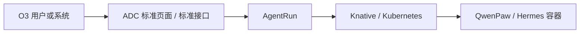
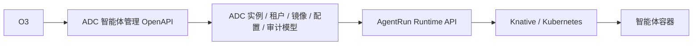
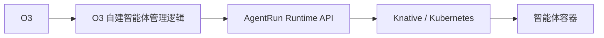
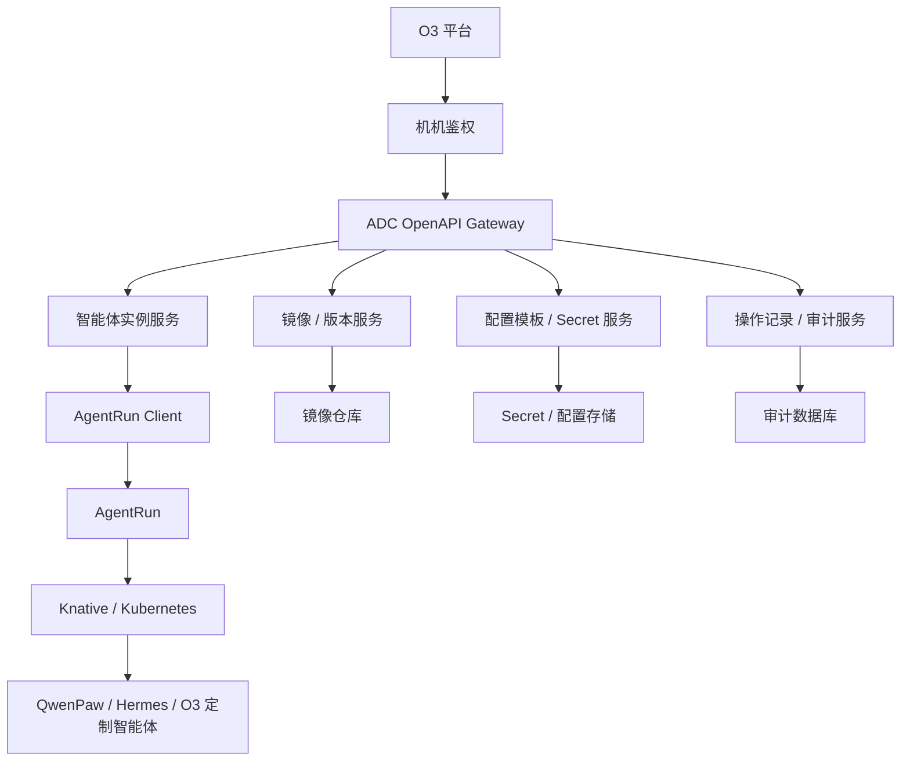
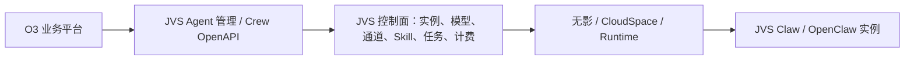

# ADC / O3 / AgentRun 智能体管理集成方案洞察与对比

日期：2026-05-14

## 1. 背景

当前系统涉及三个核心角色：

- **ADC**：智能体管理平台，面向用户提供管理页面。用户可以在 ADC 上创建、管理并使用 QwenPaw、Hermes 等智能体。
- **AgentRun**：智能体运行时平台，封装 Knative、Kubernetes 等底层运行能力。ADC 调用 AgentRun 拉起、删除、更新智能体容器。
- **O3**：另一个业务平台，希望复用 ADC 的智能体管理能力，但面临直接复用 ADC、通过 ADC 封装接口、或绕过 ADC 直接对接 AgentRun 的方案选择。

部署关系：

- ADC 和 AgentRun 运行在同一个 Kubernetes 集群。
- O3 运行在另一个 Kubernetes 集群。
- 默认前提：O3 调用 ADC 或 AgentRun 的机机接口鉴权已经打通。

本文分析 O3 如何集成智能体管理能力，并对三种方案进行洞察和对比。

## 2. 问题本质

这个问题表面上是“O3 应该调 ADC 还是 AgentRun”，本质上是：

**智能体生命周期的业务控制权应该归 ADC，还是由 O3 自己承担。**

AgentRun 更像运行时基础设施平台，负责“把容器跑起来”；ADC 更像智能体业务控制面，负责“这个智能体属于谁、是什么类型、用哪个镜像、有什么配置、数据怎么持久化、如何升级、如何审计、如何对用户呈现”。

如果 O3 直接对接 AgentRun，O3 获得了更高自由度，但也必须承接 ADC 已经沉淀的业务能力。如果 O3 通过 ADC 使用智能体能力，则可以复用 ADC 的实例模型、版本治理、租户隔离、审计、配置和后续演进能力。

核心判断：

> AgentRun 不应该轻易暴露为业务平台的直接依赖，除非 O3 明确要复制一套 ADC 的智能体管理能力。

## 3. 当前三种方案

### 3.1 方案 1：保持现状，O3 使用 ADC 标准能力

方案描述：

O3 不做深度定制，直接使用 ADC 当前已有的智能体创建、管理和使用能力。后期如果 O3 需要定制镜像，则在 ADC 现有体系外引入 O3 自己的镜像，可能涉及数据迁移和实例升级。

典型链路：

优点：

- 接入最快，几乎不需要新增架构。
- ADC 的页面、实例管理、用户体系、审计、配置能力可以直接复用。
- 运维边界简单，由 ADC 统一承接智能体管理。
- 适合 MVP 验证、早期试点、需求还不稳定的阶段。

缺点：

- O3 的产品体验会受 ADC 当前标准能力限制。
- 如果后续 O3 要使用自定义镜像或自定义配置模型，容易从“标准实例”演变为“定制实例”。
- 定制镜像引入后，可能涉及数据目录、配置文件、Secret、版本兼容、升级策略等迁移问题。
- 如果一开始没有设计好 O3 与 ADC 的租户、实例、镜像、版本关系，后续补改成本较高。

适用场景：

- O3 只是轻量复用 ADC 的智能体能力。
- O3 对产品体验和镜像定制没有强诉求。
- 当前目标是快速跑通业务闭环。

风险判断：

方案 1 的短期成本最低，但长期可能出现“先用了标准能力，后面又要定制，最后补数据迁移”的问题。它适合验证，不适合作为强定制场景的最终架构。

### 3.2 方案 2：ADC 封装 AgentRun 能力，对 O3 提供智能体管理机机接口

方案描述：

ADC 对 AgentRun 的创建、删除、启动、停止、重启、升级、状态查询等能力进行封装，对 O3 暴露稳定的智能体管理 API。O3 不直接感知 AgentRun、Kubernetes、Knative、容器端口、PVC、Secret 等底层细节，只通过 ADC 调用智能体管理能力。

假设方案 2 的含义是：

> O3 只调用 ADC 封装后的机机接口，由 ADC 继续作为智能体业务控制面。

典型链路：

优点：

- O3 复用 ADC 的领域能力，同时不被 ADC 页面形态绑定。
- AgentRun 的底层细节被 ADC 屏蔽，后续 AgentRun 替换或升级时，O3 感知较小。
- ADC 可以统一管理智能体实例、镜像版本、配置模板、数据目录、Secret、审计和操作记录。
- 适合支持 O3 自定义镜像，但仍由 ADC 负责镜像注册、版本治理、升级策略和数据兼容。
- 权限、租户、配额、操作审计可以统一收口到 ADC。
- 后续如果更多平台接入，也可以复用同一套 ADC OpenAPI。

缺点：

- ADC 需要建设一层面向外部平台的稳定机机接口。
- ADC 要承担 API 兼容性、幂等、鉴权、审计、错误码、回调、事件通知等平台化能力。
- 如果 O3 的需求非常特殊，ADC 的抽象层需要谨慎设计，否则容易被单一业务污染。
- ADC 和 O3 之间需要明确实例归属、租户映射、资源配额和故障责任边界。

适用场景：

- O3 希望复用智能体管理能力，但不想自己理解 Kubernetes / AgentRun 细节。
- O3 需要一定程度定制，比如自定义镜像、自定义 Agent 配置、自定义实例名称。
- ADC 未来希望成为多个平台共用的智能体管理控制面。

风险判断：

方案 2 是最均衡的方案。它需要一定建设成本，但可以避免 O3 直接绑定底层运行时，也可以降低后续数据迁移和多平台接入成本。

### 3.3 方案 3：O3 参考 ADC 代码，直接对接 AgentRun

方案描述：

O3 不经过 ADC，而是参考 ADC 中调用 AgentRun 的代码，自己实现智能体创建、删除、升级、状态查询、配置管理等能力，直接调用 AgentRun。

典型链路：

优点：

- O3 自由度最高，不受 ADC 领域模型和接口节奏限制。
- O3 可以完全按自己的产品逻辑设计实例、镜像、配置和页面。
- 如果 O3 和 ADC 的业务模式差异很大，直接对接可以避免 ADC 抽象层过度复杂。

缺点：

- O3 需要重复建设 ADC 已有能力，包括实例模型、镜像版本、配置模板、Secret、数据持久化、升级、审计、监控、异常处理等。
- O3 会直接耦合 AgentRun 的 API 和运行时语义，后续 AgentRun 变更会同时影响 ADC 和 O3。
- 容易形成两套智能体管理标准，长期维护成本高。
- 安全、审计、配额、租户隔离可能出现重复实现或标准不一致。
- 如果未来希望 O3 实例回归 ADC 管理，会产生更复杂的数据迁移。

适用场景：

- O3 明确要成为独立智能体管理平台。
- O3 与 ADC 的产品模型差异非常大，无法通过 ADC API 满足。
- O3 团队愿意长期承担智能体管理控制面的建设和运维责任。

风险判断：

方案 3 看起来灵活，但本质是复制 ADC 的控制面能力。除非 O3 有明确的平台化战略，否则不建议作为首选。

## 4. 方案对比

| 维度 | 方案 1：使用 ADC 标准能力 | 方案 2：ADC 封装接口给 O3 | 方案 3：O3 直连 AgentRun |
|---|---|---|---|
| 接入速度 | 最快 | 中等 | 中等偏慢 |
| 初期开发成本 | 低 | 中 | 中到高 |
| 长期维护成本 | 中到高 | 中 | 高 |
| O3 自定义能力 | 弱 | 中到强 | 最强 |
| 对 ADC 复用程度 | 高 | 高 | 低 |
| 对 AgentRun 耦合 | 低 | 低 | 高 |
| 数据迁移风险 | 中到高 | 低到中 | 高 |
| 镜像定制支持 | 后补成本高 | 可纳入标准模型 | O3 自己负责 |
| 安全审计统一性 | 高 | 高 | 低到中 |
| 多平台复用能力 | 弱 | 强 | 弱 |
| 故障责任边界 | 清晰 | 较清晰 | 容易分散 |
| 推荐程度 | 适合短期验证 | 推荐作为目标方案 | 不建议优先选择 |

## 5. 关键洞察

### 5.1 ADC 不只是 AgentRun 的 UI

如果 ADC 只是一个页面壳，O3 绕过 ADC 直接调用 AgentRun 是合理的。

但从当前背景看，ADC 承载的是智能体管理能力，包括实例、用户、镜像、版本、配置、数据、Secret、审计和生命周期。它已经是一个业务控制面，而不仅是 AgentRun 的 UI。

因此，O3 最好不要直接依赖 AgentRun，而是依赖 ADC 对外沉淀的智能体管理 API。

### 5.2 AgentRun 应该保持运行时中立

AgentRun 的职责应该尽量收敛为：

- 创建运行单元
- 删除运行单元
- 更新运行配置
- 查询运行状态
- 暴露访问入口
- 处理底层资源调度

它不应该理解太多 QwenPaw、Hermes、O3 业务语义。否则 AgentRun 会从运行时平台膨胀成业务平台，边界会变得不清晰。

### 5.3 O3 的真实诉求不是“调容器”，而是“获得智能体能力”

如果 O3 只是想创建一个智能体给用户用，它真正需要的是：

- 创建智能体实例
- 指定智能体类型和版本
- 指定模型配置或配置模板
- 获取访问地址或会话能力
- 查询实例状态
- 做升级、删除、备份和恢复

这些都是 ADC 的领域能力，不是 AgentRun 的底层能力。

### 5.4 未来定制镜像的关键不是“能不能拉起”，而是“能不能治理”

O3 后续使用自己的镜像，真正复杂的地方不是容器创建，而是：

- 镜像如何注册到 ADC
- 镜像版本如何和智能体类型绑定
- 镜像升级是否兼容旧数据
- 旧实例是否可以灰度升级
- 用户数据和 Secret 是否可迁移
- 失败后如何回滚
- 操作过程如何审计

这些能力如果放在 ADC 里统一治理，会比 O3 直接对接 AgentRun 更稳。

## 6. 推荐方案

推荐采用：

> **以方案 2 作为目标架构，方案 1 作为短期过渡，不建议优先采用方案 3。**

推荐理由：

- ADC 保持智能体业务控制面地位。
- O3 不直接耦合 AgentRun 和 Kubernetes 细节。
- 后续 O3 自定义镜像、实例升级、数据迁移可以纳入 ADC 标准模型。
- 多平台接入时可以复用同一套 ADC OpenAPI。
- 安全、审计、租户、配额、Secret、操作记录可以统一收口。

## 7. 方案 2 的目标架构

ADC 对 O3 暴露的是智能体领域接口，而不是底层容器接口。

## 8. 建议的 ADC OpenAPI 能力

### 8.1 智能体实例生命周期接口

- 创建实例
- 删除实例
- 启动实例
- 停止实例
- 重启实例
- 查询实例详情
- 查询实例列表
- 查询实例运行状态
- 查询实例访问入口

### 8.2 镜像和版本接口

- 查询支持的智能体类型
- 查询可用镜像版本
- 注册 O3 定制镜像
- 绑定镜像到智能体类型
- 标记默认版本
- 查询版本兼容信息

### 8.3 升级接口

- 升级前检查
- 创建备份点
- 执行升级
- 查询升级进度
- 升级失败回滚
- 查询升级历史

### 8.4 配置和 Secret 接口

- 查询配置模板
- 创建实例时传入配置
- 更新实例配置
- 注入模型配置
- 注入 Agent 角色定义
- 注入 Secret 引用

原则：

ADC API 不应该向 O3 返回明文 Secret。

### 8.5 事件和回调接口

- 实例创建完成事件
- 实例启动失败事件
- 实例异常退出事件
- 升级完成事件
- 升级失败事件
- 资源不足事件

如果 O3 需要感知异步操作结果，建议支持 webhook 或事件查询。

## 9. 数据模型建议

ADC 至少需要维护以下核心模型：

### 9.1 AgentInstance

表示一个智能体实例。

关键字段：

- instance_id
- tenant_id
- owner_platform，例如 `o3`
- owner_user_id
- agent_type，例如 `qwenpaw`、`hermes`
- display_name
- image_version_id
- runtime_status
- access_url
- data_volume_ref
- secret_ref
- created_at
- updated_at

### 9.2 AgentImageVersion

表示一个可运行的智能体镜像版本。

关键字段：

- image_version_id
- agent_type
- image_url
- version
- owner_platform
- compatibility_rule
- default_flag
- created_at

### 9.3 RuntimeBinding

表示 ADC 实例与 AgentRun 运行实例之间的绑定关系。

关键字段：

- instance_id
- agentrun_service_id
- namespace
- runtime_name
- endpoint
- status

### 9.4 OperationRecord

表示用户或平台对实例做过的操作。

关键字段：

- operation_id
- instance_id
- operation_type
- request_id
- idempotency_key
- operator_type
- operator_id
- status
- error_code
- error_message
- created_at
- completed_at

## 10. 数据迁移与升级策略

如果后续 O3 使用自己的镜像，建议不要把它视为“绕过 ADC 的定制容器”，而是纳入 ADC 的镜像版本体系。

推荐策略：

- O3 定制镜像先注册到 ADC。
- ADC 为该镜像生成 `AgentImageVersion`。
- 创建实例时选择 O3 镜像版本。
- 升级时通过 ADC 升级流程执行，而不是 O3 自己删除重建容器。
- 数据目录、Secret 目录、配置模板由 ADC 统一管理。

升级前应做：

- 镜像版本兼容性检查
- 数据目录备份
- Secret 引用检查
- 配置 schema 检查
- 回滚镜像确认

这样可以避免方案 1 后期定制镜像导致的数据迁移失控问题。

## 11. 安全设计建议

### 11.1 机机鉴权

O3 调 ADC OpenAPI 时建议使用：

- client_id / client_secret
- JWT
- mTLS
- 签名请求

具体方式可以结合现有机机鉴权体系。

### 11.2 租户隔离

ADC 需要明确 O3 平台下的用户、租户和 ADC 内部租户之间的映射关系。

不能只依赖 O3 传入的用户名或实例名，应有稳定的外部主体 ID。

### 11.3 权限控制

不同 O3 调用方应区分权限：

- 只读查询
- 创建实例
- 删除实例
- 升级实例
- 修改配置
- 访问 Secret 引用

### 11.4 审计

所有跨平台调用都应记录：

- 调用方平台
- 调用方用户
- 操作类型
- 实例 ID
- 请求参数摘要
- request_id
- 操作结果

### 11.5 Secret 保护

O3 可以传入 Secret 引用或密文配置，但 ADC 不应向 O3 返回明文 Secret。

## 12. 接口设计原则

ADC 对外接口应遵循以下原则：

- **领域化**：接口表达智能体语义，不暴露 Kubernetes、Pod、Service、Knative Revision 等底层概念。
- **幂等性**：创建、删除、升级等操作需要支持 `idempotency_key`。
- **异步化**：创建、升级、删除可能耗时，应返回操作 ID，支持查询进度。
- **可追踪**：所有接口支持 `request_id`。
- **可演进**：接口路径和数据结构需要版本号，例如 `/api/v1/agents/instances`。
- **错误码标准化**：不要直接透传 AgentRun 或 Kubernetes 原始错误。

## 13. 分阶段落地建议

### 阶段 1：最小可用 API

目标：让 O3 通过 ADC 创建和管理智能体实例。

范围：

- 创建实例
- 删除实例
- 查询实例
- 查询状态
- 查询访问地址
- 操作记录

不做：

- 复杂升级
- O3 自定义镜像注册
- 复杂回调

### 阶段 2：支持 O3 定制镜像

目标：解决后续定制镜像和数据迁移风险。

范围：

- 镜像注册
- 镜像版本管理
- 创建实例时选择镜像版本
- 默认镜像版本配置
- 版本兼容标记

### 阶段 3：支持升级和回滚

目标：形成稳定运维闭环。

范围：

- 升级前检查
- 备份
- 升级
- 回滚
- 升级历史

### 阶段 4：事件通知和平台化治理

目标：支持更多外部平台复用 ADC。

范围：

- webhook
- 事件查询
- 配额
- 审计报表
- 多平台调用方管理

## 14. 业界产品参考与洞察

本节补充实际产品参考，用来验证本文的核心判断：

> 成熟产品通常会把“智能体业务控制面”和“运行时基础设施”分层。外部业务系统优先调用业务控制面的领域 API，而不是直接绑定底层运行时。

### 14.1 Dify：AI 应用控制面优先，对外暴露应用级能力

产品定位：

Dify 是一个面向 AI App、Workflow、Chatflow、Agent 的平台。公开文档中，Dify 把应用分为 Workflow、Chatflow、Chatbot、Agent、Text Generator 等类型，并支持通过用户交互或 API 调用应用。

参考资料：

- Dify Key Concepts：https://docs.dify.ai/en/use-dify/getting-started/key-concepts
- Dify Agent：https://docs.dify.ai/en/use-dify/build/agent

和 ADC / AgentRun / O3 的类比：

- Dify 类似 ADC，承载 AI 应用和 Agent 的配置、编排、工具、知识库和调用入口。
- Dify 的外部消费方调用的是 App / Agent 级 API，而不是直接感知底层容器或工作进程。
- 如果某个外部系统想复用 Dify 应用能力，合理方式通常是调用 Dify 的应用 API，而不是复制 Dify 的运行时逻辑。

对本方案的启发：

- ADC 对 O3 暴露的接口应该是“创建智能体实例、调用智能体、查询状态、管理配置”等领域 API。
- 不应该让 O3 直接理解 AgentRun 的 Knative、Kubernetes、Service、Revision 等运行时细节。
- 如果 O3 要定制镜像，应该纳入 ADC 的“智能体类型 / 镜像版本 / 配置模板”模型，而不是在 ADC 之外单独漂移。

### 14.2 LangGraph Platform：Assistant / Thread / Run 抽象优先

产品定位：

LangGraph Platform 把 Agent 应用运行抽象为 Assistant、Thread、Run。官方文档中，Run 会把 Assistant 的配置应用到某个 Thread 的图执行上，并支持流式执行与状态持久化。

参考资料：

- LangGraph Threads：https://docs.langchain.com/langgraph-platform/use-threads
- LangGraph Streaming：https://docs.langchain.com/langgraph-platform/streaming

和 ADC / AgentRun / O3 的类比：

- Assistant 类似“智能体定义 / 配置模板”。
- Thread 类似“会话 / 上下文状态”。
- Run 类似“一次执行任务 / 对话请求 / 异步执行单元”。
- 外部系统调用的是 LangGraph 的领域 API，而不是直接管理执行 worker。

对本方案的启发：

- ADC 给 O3 的接口不应只有“创建容器”，还应该逐步抽象出实例、会话、运行、事件、流式输出等模型。
- 如果 O3 后续需要聊天、任务、流式返回，建议不要绕过 ADC，而是让 ADC 暴露类似 `session/run/stream` 的稳定接口。
- AgentRun 只负责运行载体，ADC 负责业务语义和状态管理。

### 14.3 Azure AI Foundry Agent Service：Agent / Thread / Message / Run 模型

产品定位：

Azure AI Foundry Agent Service 使用 Agent、Thread、Message、Run 等概念管理智能体执行。Thread 存储对话消息，Run 触发 Agent 基于 Thread 执行任务。

参考资料：

- Azure AI Foundry Agent Service Threads / Runs / Messages：https://learn.microsoft.com/en-us/azure/ai-services/agents/concepts/threads-runs-messages

和 ADC / AgentRun / O3 的类比：

- Azure 没有让业务方直接管理底层容器，而是提供 Agent Service API。
- 用户侧面对的是 Agent、Thread、Run 这些领域对象。
- 运行时、模型、工具、持久状态由平台封装。

对本方案的启发：

- ADC 如果要面向 O3 提供智能体能力，接口应从一开始就避免“容器 CRUD 化”。
- 可以先提供实例生命周期接口，后续逐步演进到会话、消息、运行、流式事件接口。
- 这支持方案 2，而不是方案 3。

### 14.4 Google Vertex AI Agent Engine：托管 Agent 部署、管理和扩缩容

产品定位：

Google Vertex AI Agent Engine 是 Vertex AI 中用于部署、管理和扩缩容生产级 Agent 的服务。官方说明强调它支持部署、管理、扩缩容，并与 Cloud Trace、Cloud Monitoring、Cloud Logging 等观测能力集成。

参考资料：

- Vertex AI Agent Engine Overview：https://cloud.google.com/vertex-ai/generative-ai/docs/reasoning-engine/deploy
- Vertex AI Agent Engine Deploy：https://cloud.google.com/vertex-ai/generative-ai/docs/agent-engine/deploy

和 ADC / AgentRun / O3 的类比：

- Vertex AI Agent Engine 本身更接近“Agent 运行和管理平台”的结合体。
- 它对用户暴露的是 Agent Engine 的部署和管理能力，而不是要求用户直接操作 Kubernetes。
- 观测、日志、追踪、运行状态被平台统一托管。

对本方案的启发：

- ADC 和 AgentRun 当前是拆分的：ADC 管业务控制面，AgentRun 管运行时。
- 对 O3 来说，最好感知 ADC 提供的统一 Agent 管理能力，而不是直接感知 AgentRun。
- 如果后续要增强平台能力，可以参考 Vertex 的方向，把日志、追踪、状态、版本、权限纳入 ADC 统一管理。

### 14.5 Amazon Bedrock Agents / AgentCore：Agent 能力与 Runtime 能力分层

产品定位：

Amazon Bedrock Agents 面向业务自动化，支持 Agent、Action Group、Knowledge Base 等配置。Amazon Bedrock AgentCore 则进一步提供 Runtime、Memory、Gateway、Identity 等 Agent 基础设施能力。官方文档说明 AgentCore Runtime 支持自定义框架和开源框架，提供会话隔离、身份能力、异步 Agent 运行等。

参考资料：

- Amazon Bedrock Agents：https://docs.aws.amazon.com/bedrock/latest/userguide/agents.html
- Amazon Bedrock AgentCore Overview：https://docs.aws.amazon.com/bedrock-agentcore/latest/devguide/what-is-bedrock-agentcore.html

和 ADC / AgentRun / O3 的类比：

- Bedrock Agents 更像业务侧 Agent 定义和能力编排。
- AgentCore Runtime 更像运行时基础设施。
- Memory、Gateway、Identity 说明平台把状态、后端工具、身份能力作为独立基础设施能力治理。

对本方案的启发：

- ADC / AgentRun 分层是合理的，不应该把所有能力都塞进 AgentRun。
- ADC 应负责 Agent 定义、实例、配置、租户、审计、版本治理。
- AgentRun 应更像 AgentCore Runtime，负责可靠运行、隔离、伸缩和运行状态。
- O3 应调用 ADC 的领域 API，而不是直接把 AgentRun 当成自己的基础设施 SDK。

### 14.6 Portainer：容器管理控制面对外提供 API，而不是让用户直接写 Docker 细节

产品定位：

Portainer 是 Docker、Docker Swarm、Kubernetes、Podman、Azure ACI 等容器环境的管理控制面。官方文档说明 Portainer 暴露 HTTP API，可以自动化 UI 中能做的操作，并提供 RBAC、Registry 管理等能力。

参考资料：

- Portainer API：https://docs.portainer.io/api/docs
- Portainer Overview：https://docs.portainer.io/

和 ADC / AgentRun / O3 的类比：

- Portainer 不是 AI Agent 平台，但它是典型“资源控制面”产品。
- 用户可以通过 UI 或 API 管理容器资源。
- 它对底层 Docker / Kubernetes 做了一层管理封装。

对本方案的启发：

- ADC 应该像智能体领域的 Portainer：对外提供稳定 API，对内调用 AgentRun。
- AgentRun 不应该直接成为所有业务平台的公共依赖，否则后续治理会分散。
- 如果 O3 只是需要“创建、删除、重启、升级智能体”，它更应该调 ADC 的管理 API。

### 14.7 Rancher：多集群控制面统一管理底层 Kubernetes

产品定位：

Rancher 是 Kubernetes 多集群管理平台，提供跨发行版、跨云、跨本地集群的统一生命周期管理能力。官方资料强调它支持多集群管理、生命周期管理、配置漂移控制等。

参考资料：

- Rancher Products：https://www.rancher.com/products/rancher
- SUSE Rancher Prime：https://www.rancher.com/products/rancher-platform

和 ADC / AgentRun / O3 的类比：

- Rancher 面向 Kubernetes 管理，ADC 面向智能体实例管理。
- Rancher 的价值不是“替用户调用 kubectl”，而是把多集群、权限、策略、升级、生命周期统一治理。
- ADC 也不应只是“替 O3 调 AgentRun”，而应沉淀智能体实例治理能力。

对本方案的启发：

- 如果未来不止 O3，一个 ADC 管多个外部平台、多类智能体、多套运行时，那么 ADC 的定位会越来越像智能体控制面。
- 方案 2 更利于 ADC 演进成统一智能体管理平台。
- 方案 3 会造成多个平台分别直连 AgentRun，类似多个系统各自绕过 Rancher 操作底层集群，长期治理成本高。

### 14.8 产品参考汇总

| 产品 | 更像 ADC | 更像 AgentRun | 对方案选择的启发 |
|---|---:|---:|---|
| Dify | 是 | 否 | 外部系统应调用 AI App / Agent 级 API，不直接感知底层运行 |
| LangGraph Platform | 是 | 部分是 | Assistant / Thread / Run 是领域抽象，不是容器抽象 |
| Azure AI Foundry Agent Service | 是 | 部分是 | Agent / Thread / Run 统一封装执行和状态 |
| Vertex AI Agent Engine | 是 | 是 | 托管 Agent 的部署、管理、扩缩容、观测统一平台化 |
| Amazon Bedrock Agents | 是 | 否 | 业务 Agent 配置和工具编排不等同于运行时 |
| Amazon Bedrock AgentCore | 否 | 是 | Runtime、Memory、Gateway、Identity 是基础设施能力 |
| Portainer | 控制面类比 | 部分是 | 控制面对外提供 API，屏蔽 Docker / K8s 细节 |
| Rancher | 控制面类比 | 否 | 多集群生命周期治理说明控制面价值大于简单透传底层 API |

### 14.9 从业界产品得到的结论

从上述产品可以看到三个趋势：

1. **业务平台优先暴露领域对象，不暴露底层容器对象。**

   Dify、LangGraph、Azure AI Foundry 都不是让外部系统直接创建底层容器，而是暴露 App、Agent、Thread、Run 等领域模型。

2. **运行时能力被平台封装，外部消费方不直接绑定基础设施。**

   Vertex AI Agent Engine、Bedrock AgentCore、Portainer、Rancher 都说明一个事实：越是长期治理，越需要控制面屏蔽底层运行细节。

3. **直接对接底层运行时只适合强平台团队。**

   如果 O3 直接对接 AgentRun，它实际上是在建设自己的 ADC。除非 O3 明确要成为独立智能体管理平台，否则这是长期成本更高的路线。

因此，业界产品参考进一步支持本文推荐：

> 方案 2 更符合主流产品架构。ADC 对外提供智能体管理领域 API，AgentRun 保持运行时基础设施，O3 作为外部平台消费 ADC 能力。

### 14.10 JVS Claw / ArkClaw 对 O3 类诉求的启发

ADC 的产品形态参考 ArkClaw 和 JVS Claw，因此这里单独分析：如果 JVS Claw 或 ArkClaw 面对“O3 想复用智能体管理能力”的诉求，它们更可能怎么做。

#### 14.10.1 JVS Claw：公开资料显示更接近“方案 2”

JVS Claw 的公开文档中已经出现两类能力：

1. **Agent 管理中心 OpenAPI**

   阿里云文档提供了 Agent 管理中心 OpenAPI 索引，覆盖创建 JVS Claw 或 OpenClaw、查询 Agent 运行时、查询模型配置、查询三方通道配置、模型模板、通道配置、Skill 查询与授权、安全策略、积分配额和用量查询等能力。

   参考资料：

   - Agent 管理中心 OpenAPI 索引：https://help.aliyun.com/zh/wuying-workspace/agent-management-center-openapi-index

   这说明 JVS 的控制面不是只给人操作的 UI，而是已经在向外提供“Agent 管理领域 API”。

2. **JVS Crew API**

   JVS Crew API 面向外部应用提供 AI 对话集成能力，文档中包含：

   - 获取 AccessToken
   - Chat 流式对话，SSE 返回
   - 文件上传
   - 同步文件到沙箱
   - 会话列表、会话历史、删除会话、中止会话
   - 创建、更新、查询、删除定时任务
   - 计费和用户消耗查询

   参考资料：

   - JVS Crew API 参考：https://help.aliyun.com/zh/jvs/developer-reference/jvs-crew-api-reference

   这说明 JVS 面向第三方业务系统时，不只是开放“容器创建”，而是开放了完整的“对话、会话、文件、任务、计费”领域接口。

结合 O3 的诉求，如果是 JVS 来做，大概率不是让 O3 直接调用底层运行时，而是：

对应到本文三种方案：

- JVS 的 Agent 管理中心 OpenAPI 对应 **方案 2**。
- JVS Crew API 对应 **方案 2 的进一步产品化版本**，不只管理实例，还管理对话、文件、会话、任务和计费。
- JVS 不太可能建议 O3 直接绕过 JVS 控制面去调用底层无影、Kubernetes 或运行时资源。

JVS 对 ADC 的启发：

- ADC 不应该只封装 AgentRun 的 `create/delete/update`。
- ADC 应该沉淀成 Agent 管理 OpenAPI，逐步覆盖实例、模型、通道、Skill、任务、文件、会话、用量。
- O3 的用户标识应作为 `ExternalUserId` 之类的外部用户 ID 映射进 ADC，而不是要求 O3 用户直接成为 ADC 原生用户。
- ADC 应该支持 API 调用和页面操作两种入口，并共享同一套实例和会话数据。

#### 14.10.2 ArkClaw：公开资料偏消费端，但产品形态也支持“控制面统一”

ArkClaw 的公开资料比 JVS 少，暂未看到类似 JVS Agent 管理中心 OpenAPI 的完整官方接口文档。因此对 ArkClaw 的判断需要分为“可确认事实”和“架构推断”。

可确认事实：

- ArkClaw 主打云端托管，减少本地运维负担。
- ArkClaw 强调多设备实时同步，对话记忆和配置跨设备同步。
- ArkClaw 支持 7×24 在线和后台定时任务。
- ArkClaw 强调企业级安全、数据权限和自动化工作流。

参考资料：

- ArkClaw Hub：https://arkclawhub.com/
- ArkClaw 英文入口：https://arkclawhub.com/en/index.html

基于这些产品特征，可以推断 ArkClaw 内部一定存在一个统一控制面，用来管理：

- 用户账号和套餐权益
- 云端实例
- 多设备会话同步
- 定时任务
- Skill 包
- 配置和状态
- 权限和安全策略

如果 ArkClaw 面对 O3 类诉求，大概率会提供两种路径：

1. **SaaS 集成路径**

   O3 作为外部业务系统，调用 ArkClaw 的控制面能力创建或绑定用户的云端龙虾，并通过 ArkClaw 的对话/任务接口使用能力。

2. **企业版 / 私有化路径**

   如果 O3 对品牌、镜像、数据边界、权限模型有强定制需求，ArkClaw 更可能提供企业版、私有化或专属租户，而不是让 O3 直接调用底层云资源。

对应到本文三种方案：

- ArkClaw 的公开产品形态更接近 **方案 1 + 方案 2**。
- 面向普通用户是方案 1：直接使用 ArkClaw 标准能力。
- 面向业务平台或企业客户，更合理的是方案 2：ArkClaw 控制面开放租户级或企业级接口。
- 方案 3，即 O3 直接对接 ArkClaw 背后的运行时基础设施，公开资料中没有看到这种模式，也不符合其“云端托管、少运维”的产品定位。

ArkClaw 对 ADC 的启发：

- ADC 如果参考 ArkClaw，就应强调“托管、同步、任务、权限、低运维”，而不是把底层运行时暴露给 O3。
- O3 类平台接入时，ADC 应该提供租户级能力，而不是只提供单实例容器创建。
- 如果 O3 希望定制镜像，可以设计为“ADC 中的 O3 专属 Agent 类型 / 镜像版本 / Skill 包”，而不是让 O3 直接绕过 ADC。

#### 14.10.3 竞品视角下对三种方案的重新判断

| 方案 | JVS Claw 参考 | ArkClaw 参考 | 判断 |
|---|---|---|---|
| 方案 1：O3 使用 ADC 标准能力 | 类似用户直接使用 JVS 控制台和客户端 | 类似用户直接使用 ArkClaw SaaS | 适合 MVP 或低定制 |
| 方案 2：ADC 封装 AgentRun，对 O3 提供 API | 高度符合 JVS Agent 管理中心 OpenAPI / JVS Crew API | 符合 ArkClaw 云端托管控制面逻辑 | 最推荐 |
| 方案 3：O3 直连 AgentRun | 与 JVS 的控制面开放方向不一致 | 与 ArkClaw 少运维、托管定位不一致 | 不推荐 |

竞品参考后的结论：

> 如果 ADC 要对齐 JVS Claw 和 ArkClaw 的产品方向，就不应该把 O3 引导到 AgentRun 层。更合理的路线是把 ADC 做成智能体管理控制面，对 O3 暴露 Agent 管理、对话、任务、文件、模型、Skill、用量等领域 API。

## 15. 不推荐方案 3 的原因

方案 3 最大的问题不是技术上做不到，而是它会让 O3 复制 ADC 的长期责任。

短期看，O3 直接调用 AgentRun 可以绕过 ADC 的抽象设计，看起来更快。

但长期会出现：

- ADC 和 O3 各自维护一套智能体实例模型。
- O3 需要自己处理镜像版本、升级、数据、Secret、审计。
- AgentRun API 一旦变化，ADC 和 O3 都要适配。
- 两个平台上的智能体实例标准不一致。
- 未来如果要统一治理，需要二次迁移。

除非 O3 明确要独立建设完整智能体管理平台，否则不建议走方案 3。

## 16. 结论

推荐路径：

1. 短期可以用方案 1 快速验证 O3 对智能体能力的真实需求。
2. 中期应尽快演进到方案 2，由 ADC 提供面向 O3 的智能体管理 OpenAPI。
3. 不建议 O3 直接对接 AgentRun，除非 O3 明确要承担完整智能体管理控制面的长期建设。

最终建议：

> ADC 作为智能体业务控制面，AgentRun 作为运行时基础设施，O3 作为外部业务消费方。O3 应通过 ADC 的领域化 OpenAPI 使用智能体能力，而不是直接绑定 AgentRun。

## 17. 待确认问题

以下问题会影响最终方案细化：

- O3 是否需要完全自有 UI，还是只需要后台 API 能力？
- O3 是否已经确定要使用自己的定制镜像？
- O3 的用户和 ADC 的租户如何映射？
- O3 创建的智能体实例是否需要在 ADC 页面可见？
- 智能体数据目录和 Secret 由 ADC 统一托管，还是 O3 希望独立托管？
- O3 是否需要订阅实例状态变更事件？
- O3 是否需要直接访问智能体聊天、文件、模型配置等能力？
- AgentRun 当前接口是否稳定，是否已有版本化 API？
