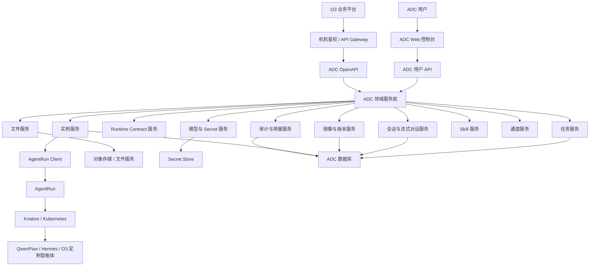
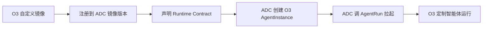

# ADC 智能体管理平台目标方案设计

日期：2026-05-15

## 1. 文档目的

本文用于支持 ADC 方案设计评审。

当前背景：

- **ADC**：智能体管理平台，面向用户提供管理页面，支持创建和管理 QwenPaw、Hermes 等智能体。
- **AgentRun**：运行时平台，封装 Knative、Kubernetes 等能力，负责拉起智能体容器或运行环境。
- **O3**：另一个业务平台，希望复用 ADC 的智能体管理能力，未来可能定制镜像甚至定制智能体代码。

本文目标：

- 明确 ADC 的目标定位。
- 明确 ADC、AgentRun、O3 的职责边界。
- 给出目标架构、核心领域模型和 API 分层。
- 给出 O3 定制镜像和数据迁移方案。
- 给出分阶段落地计划。

## 2. 核心结论

推荐目标架构：

> ADC 作为智能体管理控制面，对 O3 提供领域化 OpenAPI；AgentRun 作为运行时基础设施，由 ADC 调用；O3 不直接依赖 AgentRun。

ADC 不应只是 AgentRun 的 UI，也不应只是容器 CRUD 的转发层。

ADC 应承担三类角色：

1. **Agent 管理中心**

   管理智能体实例、镜像版本、模型配置、通道配置、Skill、安全策略、用量和运行时绑定。

2. **智能体产品控制台**

   面向用户提供创建、对话、文件、任务、模型、技能、实例详情、升级、修复等页面能力。

3. **企业开放 API**

   面向 O3 等外部业务平台提供机机接口，包括实例、会话、流式对话、文件、任务、模型、用量和审计。

## 3. 竞品洞察结论

### 3.1 参考 JVS Agent 管理中心

JVS Agent 管理中心公开 OpenAPI 覆盖：

- 创建 JVS Claw 或 OpenClaw。
- Agent 运行时查询。
- 模型配置。
- 三方通道配置。
- Skill 查询与授权。
- 安全策略。
- 积分配额和用量。

对 ADC 的启发：

> 创建和管理智能体运行环境，应由 ADC 控制面承接，而不是让 O3 直接调用底层运行时。

### 3.2 参考 JVS Crew

JVS Crew 提供企业级 API，覆盖：

- AccessToken。
- Chat 流式对话。
- 会话列表和历史。
- 文件上传和同步。
- 定时任务。
- 计费和用户消耗。

对 ADC 的启发：

> O3 如果要在自己的系统中集成智能体能力，需要的是 Crew 风格 API，而不是容器 API。

### 3.3 参考 ArkClaw

ArkClaw 体现了托管智能体产品的关键能力：

- 一键云端部署。
- 一对一专属 ECS。
- 7×24 在线。
- 模型和密钥托管。
- TOS 文件传输。
- Skills Hub。
- 飞书/钉钉通道。
- 自动升级、一键修复。
- 本地 OpenClaw 数据迁移到云端。

对 ADC 的启发：

> ADC 要管理的是智能体资产，而不仅是容器。智能体资产包括实例、模型、文件、任务、技能、通道、密钥、版本、用量和数据迁移。

## 4. 目标架构

## 5. 职责边界

### 5.1 ADC 职责

ADC 负责智能体业务控制面：

- 管理智能体实例。
- 管理镜像和版本。
- 管理运行时契约。
- 管理模型配置和密钥。
- 管理会话、文件、任务。
- 管理 Skill 和通道。
- 管理升级、修复、备份、恢复。
- 管理租户、权限、审计和用量。
- 对 O3 暴露稳定 OpenAPI。

### 5.2 AgentRun 职责

AgentRun 负责运行时基础设施：

- 创建运行单元。
- 删除运行单元。
- 启动、停止、重启。
- 查询运行状态。
- 资源调度。
- 网络入口。
- 与 Knative / Kubernetes 对接。

AgentRun 不应理解太多业务语义，例如：

- O3 用户是谁。
- 当前会话属于哪个会员。
- 模型 Key 怎么配置。
- 文件属于哪个业务会话。
- Skill 是否已授权。
- 这个实例该不该升级。

### 5.3 O3 职责

O3 是外部业务消费方：

- 通过 ADC OpenAPI 创建和管理智能体。
- 通过 ADC OpenAPI 发起对话、上传文件、创建任务。
- 维护 O3 自己的业务用户和业务页面。
- 不直接依赖 AgentRun。

## 6. 核心领域模型

### 6.1 AgentInstance

智能体实例。

关键字段：

- `instance_id`
- `tenant_id`
- `owner_platform`，例如 `adc`、`o3`
- `external_user_id`
- `agent_type`，例如 `qwenpaw`、`hermes`、`o3-qwenpaw`
- `display_name`
- `image_version_id`
- `runtime_contract_version`
- `data_schema_version`
- `runtime_status`
- `access_url`
- `data_volume_ref`
- `secret_volume_ref`
- `created_at`
- `updated_at`

### 6.2 AgentImageVersion

智能体镜像版本。

关键字段：

- `image_version_id`
- `agent_type`
- `image_url`
- `version`
- `owner_platform`
- `runtime_contract_version`
- `data_schema_version`
- `compatibility_rule`
- `default_flag`
- `created_at`

### 6.3 RuntimeBinding

ADC 实例与 AgentRun 运行时之间的绑定关系。

关键字段：

- `instance_id`
- `runtime_id`
- `namespace`
- `service_name`
- `endpoint`
- `status`
- `last_heartbeat_at`

### 6.4 RuntimeContract

运行时契约。

关键字段：

- `contract_version`
- `health_check_path`
- `chat_stream_path`
- `session_list_path`
- `file_upload_path`
- `model_config_path`
- `task_path`
- `working_dir`
- `secret_dir`
- `capabilities`

### 6.5 OperationRecord

操作记录。

关键字段：

- `operation_id`
- `instance_id`
- `operation_type`
- `request_id`
- `idempotency_key`
- `operator_type`
- `operator_id`
- `status`
- `error_code`
- `error_message`
- `created_at`
- `completed_at`

## 7. ADC OpenAPI 分层设计

### 7.1 实例管理 API

面向 O3 和 ADC 页面。

能力：

- 创建实例。
- 删除实例。
- 启动实例。
- 停止实例。
- 重启实例。
- 修复实例。
- 查询实例详情。
- 查询实例列表。
- 查询运行状态。
- 查询访问入口。

建议接口：

- `POST /api/v1/agent-instances`
- `GET /api/v1/agent-instances`
- `GET /api/v1/agent-instances/{id}`
- `POST /api/v1/agent-instances/{id}:start`
- `POST /api/v1/agent-instances/{id}:stop`
- `POST /api/v1/agent-instances/{id}:restart`
- `POST /api/v1/agent-instances/{id}:repair`
- `DELETE /api/v1/agent-instances/{id}`

### 7.2 镜像和版本 API

能力：

- 注册镜像。
- 查询镜像版本。
- 设置默认镜像。
- 查询兼容性。
- 查询可升级版本。

建议接口：

- `POST /api/v1/agent-images`
- `GET /api/v1/agent-images`
- `GET /api/v1/agent-images/{id}`
- `POST /api/v1/agent-images/{id}:set-default`

### 7.3 升级和迁移 API

能力：

- 升级前检查。
- 创建备份点。
- 执行升级。
- 查询升级进度。
- 失败回滚。
- 查询升级历史。

建议接口：

- `POST /api/v1/agent-instances/{id}:precheck-upgrade`
- `POST /api/v1/agent-instances/{id}:backup`
- `POST /api/v1/agent-instances/{id}:upgrade`
- `GET /api/v1/operations/{operation_id}`
- `POST /api/v1/operations/{operation_id}:rollback`

### 7.4 会话和流式对话 API

能力：

- 创建会话。
- 查询会话列表。
- 查询会话历史。
- 流式对话。
- 中止对话。
- 删除会话。

建议接口：

- `POST /api/v1/agent-instances/{id}/sessions`
- `GET /api/v1/agent-instances/{id}/sessions`
- `GET /api/v1/sessions/{session_id}/messages`
- `POST /api/v1/sessions/{session_id}/chat:stream`
- `POST /api/v1/sessions/{session_id}:stop`
- `DELETE /api/v1/sessions/{session_id}`

### 7.5 文件 API

能力：

- 获取上传 URL。
- 上传文件元数据登记。
- 文件绑定会话。
- 文件同步到运行时。
- 查询文件列表。
- 下载文件。

建议接口：

- `POST /api/v1/files:prepare-upload`
- `POST /api/v1/files:complete-upload`
- `POST /api/v1/files/{file_id}:sync-to-instance`
- `GET /api/v1/files`
- `GET /api/v1/files/{file_id}`

### 7.6 任务 API

能力：

- 创建任务。
- 查询任务。
- 查询任务结果。
- 创建定时任务。
- 更新定时任务。
- 删除定时任务。

建议接口：

- `POST /api/v1/tasks`
- `GET /api/v1/tasks`
- `GET /api/v1/tasks/{task_id}`
- `POST /api/v1/scheduled-tasks`
- `PATCH /api/v1/scheduled-tasks/{id}`
- `DELETE /api/v1/scheduled-tasks/{id}`

### 7.7 模型和 Secret API

能力：

- 查询当前激活模型。
- 激活模型。
- 设置平台默认模型。
- 设置租户默认模型。
- 查询模型模板。

建议接口：

- `GET /api/v1/models/active`
- `POST /api/v1/models:activate`
- `GET /api/v1/model-templates`
- `POST /api/v1/default-model-config`

要求：

- API 不返回明文 Key。
- Secret 只返回脱敏值。
- 审计所有模型配置变更。

## 8. O3 定制镜像方案

### 8.1 问题

O3 现在可能先使用 ADC 标准 QwenPaw/Hermes 实例。

但未来 O3 可能：

- 使用自己的镜像。
- 定制智能体代码。
- 定制 Skill。
- 定制模型配置。
- 定制数据结构。

如果当前设计只把实例当成 ADC 标准镜像，后续迁移成本会很高。

### 8.2 目标原则

O3 自定义镜像不应绕过 ADC。

推荐做法：

### 8.3 Runtime Contract

所有 ADC 托管的智能体镜像必须遵守 Runtime Contract。

最小契约：

- 固定服务端口。
- 健康检查接口。
- 版本和能力声明接口。
- 流式对话接口。
- 会话查询接口。
- 文件同步接口。
- 模型配置接口。
- 任务接口。
- 工作目录。
- Secret 目录。
- 备份和迁移脚本位置。

### 8.4 迁移策略

从 ADC 标准镜像迁移到 O3 自定义镜像时：

1. 冻结旧实例，阻止新任务进入。
2. 创建数据备份和 Secret 备份。
3. 创建新镜像候选实例。
4. 挂载备份副本。
5. 执行迁移脚本。
6. 执行健康检查。
7. 执行对话、会话、文件、模型配置校验。
8. 切换访问入口。
9. 保留旧实例回滚窗口。

### 8.5 迁移成本估算

| 定制深度 | 说明 | 估算 |
|---|---|---|
| 只换镜像，接口和目录完全兼容 | 遵守同一 Runtime Contract | 3-5 人天 |
| 定制代码，但保持接口和目录兼容 | 需要兼容验证和少量适配 | 5-10 人天 |
| 数据结构变化 | 需要迁移脚本、校验、回滚 | 10-20 人天 |
| 深度 fork | 接口、目录、会话、文件、任务模型都不同 | 20-40+ 人天 |

## 9. 数据与持久化设计

ADC 应把数据分为四类。

### 9.1 平台元数据

存 ADC 数据库：

- 实例。
- 镜像版本。
- 操作记录。
- 会话索引。
- 文件元数据。
- 任务元数据。
- 用量和审计。

### 9.2 实例工作数据

存持久卷或对象存储：

- 工作目录。
- 会话文件。
- 记忆文件。
- 用户生成文件。
- 任务产物。

### 9.3 Secret 数据

存 Secret Store：

- 模型 Key。
- 通道 Token。
- 第三方凭证。

要求：

- 不明文返回。
- 可轮换。
- 可按租户/实例隔离。

### 9.4 文件资产

建议存对象存储：

- 用户上传文件。
- 任务产物。
- 导出文件。
- 备份包。

实例只拿文件引用或临时访问凭证。

## 10. 安全设计

### 10.1 机机鉴权

O3 调 ADC 应使用：

- client_id / client_secret。
- JWT。
- mTLS。
- 请求签名。

具体方式可按现有集团机机鉴权体系选型。

### 10.2 租户隔离

ADC 必须维护：

- `tenant_id`
- `owner_platform`
- `external_user_id`
- `instance_id`

O3 的用户不能直接等同于 ADC 用户，需要做外部用户映射。

### 10.3 审计

所有关键操作写审计：

- 创建实例。
- 删除实例。
- 重启。
- 修复。
- 升级。
- 模型配置。
- Secret 变更。
- 文件上传。
- 任务创建。
- 对话调用。

### 10.4 敏感信息保护

ADC 与智能体侧需要共同保证：

- 模型 Key 不明文展示。
- Secret 不进入日志。
- 对话输出做敏感信息脱敏。
- 文件和工具输出做敏感信息扫描。
- API 返回值统一脱敏。

## 11. 分阶段落地计划

### 阶段 1：实例管理 MVP

目标：

- 支持 O3 通过 ADC 创建和管理标准智能体实例。

范围：

- 创建实例。
- 删除实例。
- 查询实例。
- 启动/停止/重启。
- 运行状态查询。
- RuntimeBinding。
- 操作记录。

### 阶段 2：镜像版本和 Runtime Contract

目标：

- 为 O3 定制镜像做准备。

范围：

- 镜像版本注册。
- Runtime Contract 定义。
- 实例创建时选择镜像版本。
- 版本兼容性校验。
- 健康检查和能力声明。

### 阶段 3：Crew 风格 API

目标：

- 支持 O3 在自己的系统里集成智能体能力。

范围：

- 会话。
- 流式对话。
- 文件上传。
- 文件同步。
- 定时任务。
- 用量查询。

### 阶段 4：升级、迁移、备份恢复

目标：

- 支持 O3 自定义镜像和长期运维。

范围：

- 升级前检查。
- 备份。
- 迁移脚本。
- 迁移校验。
- 回滚。
- 升级历史。

### 阶段 5：平台治理

目标：

- 支持更多平台接入。

范围：

- 多租户。
- 配额。
- 计费。
- 审计报表。
- 安全策略。
- Skill 审核。

## 12. 关键风险与应对

### 12.1 O3 后续定制过深

风险：

O3 深度 fork 智能体代码，导致 ADC Runtime Contract 无法约束。

应对：

- 提前定义 Contract。
- 定制镜像必须注册兼容版本。
- 不兼容镜像只能作为新 Agent 类型接入。

### 12.2 ADC API 变成 AgentRun 透传

风险：

ADC 只是包装 AgentRun 的 create/delete/update，无法承接模型、文件、任务、会话等能力。

应对：

- API 设计必须领域化。
- 外部接口避免出现 Pod、Service、Knative 等底层概念。

### 12.3 数据迁移不可控

风险：

后续换镜像时丢失会话、文件、任务、模型配置。

应对：

- 数据 schema 版本化。
- 备份和迁移脚本标准化。
- 升级前检查和回滚。

### 12.4 多平台权限混乱

风险：

O3 用户、ADC 用户、运行时实例之间关系不清。

应对：

- 明确 `owner_platform` 和 `external_user_id`。
- 所有 API 鉴权后都落租户和主体。
- 操作全审计。

## 13. 评审关注点

建议评审重点确认：

- ADC 是否被认可为智能体管理控制面。
- O3 是否接受只调用 ADC，不直连 AgentRun。
- O3 定制镜像是否愿意遵守 Runtime Contract。
- ADC 是否需要一期就支持 Crew 风格 API。
- 文件和 Secret 是否由 ADC 统一托管。
- 升级和迁移是否纳入本期范围。
- AgentRun 是否只暴露给 ADC，不对 O3 直接开放。

## 14. 结论

ADC 的目标不应该是“容器管理台”，而应该是“智能体资产控制面”。

最终目标架构：

- ADC 负责智能体实例、镜像、模型、文件、任务、Skill、通道、升级、迁移、安全和审计。
- AgentRun 负责运行时基础设施。
- O3 通过 ADC OpenAPI 使用智能体能力。
- O3 自定义镜像纳入 ADC 的镜像版本和 Runtime Contract。

一句话总结：

> 参考 JVS Agent 管理中心做实例控制面，参考 JVS Crew 做企业 API，参考 ArkClaw 做托管产品体验，ADC 才能支撑 O3 当前接入和未来定制镜像的长期演进。

