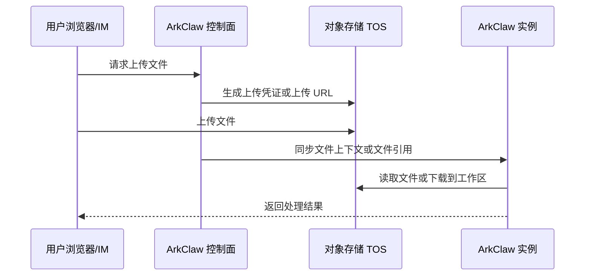
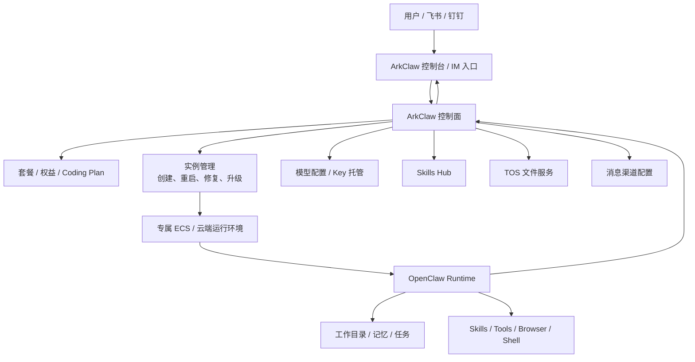

# ArkClaw 竞品分析与对 ADC 的架构启发

日期：2026-05-15

## 1. 分析目标

本文补充 ArkClaw 的竞品分析，用于支撑 ADC 的设计评审。

ADC 当前定位是智能体管理平台，用户可以创建 QwenPaw、Hermes 等智能体；底层通过 AgentRun 拉起容器或运行时实例。O3 作为外部业务平台，希望复用 ADC 的智能体管理能力，同时未来可能定制镜像甚至定制智能体代码。

ArkClaw 作为云端 SaaS 版 OpenClaw 的代表产品，对 ADC 有很强参考价值，尤其是：

- 云端托管智能体实例如何包装成产品。
- 用户是否需要感知底层容器、端口、镜像。
- 平台如何处理模型、密钥、文件、技能、通道、升级和修复。
- 如果未来接入 O3 这种业务平台，应暴露什么层级的能力。

## 2. 资料来源与可信度说明

本文引用资料分为两类：

- **官方资料**：火山引擎文章和火山引擎文档入口，可信度较高。
- **社区/媒体资料**：ArkClaw Hub、OpenClaw Blog、AI 工具站等，适合补充产品体验和市场定位，但不作为内部实现的强证据。

主要参考：

- 火山引擎文章《ArkClaw AI智能体：云端自动化办公零门槛解决方案》：https://www.volcengine.com/article/36247
- 火山引擎 ArkClaw 文档入口：https://www.volcengine.com/docs/82379/2229107
- ArkClaw Hub：https://arkclawhub.com/
- OpenClaw Blog ArkClaw 评测：https://openclawai.net/zh/blog/arkclaw-review
- AI铺子 ArkClaw 介绍：https://www.aipuzi.cn/ai-news/arkclaw.html

需要注意：

> ArkClaw 的内部控制面、运行时编排、数据模型、API 细节并未完整公开。本文的“运行原理”部分包含基于公开能力的架构推断。

## 3. ArkClaw 的产品定位

从公开资料看，ArkClaw 的定位可以概括为：

> 火山引擎托管的云端 OpenClaw / AI Agent SaaS，面向个人与轻办公场景，提供零部署、低运维、7×24 在线的专属智能体环境。

火山引擎文章中明确提到：

- ArkClaw 是云端托管的 OpenClaw 服务。
- 面向个人与轻办公场景。
- 一键云端部署 OpenClaw。
- 提供一对一专属 ECS 资源。
- 7×24 小时在线运行。
- 用户无需本地部署、无需编写代码或配置 API Key。
- 支持定时自动升级、一键修复、智能纠错。
- 不暴露公网端口，搭配 TOS 实现文件安全传输。
- 支持专属 Skills Hub。
- 支持消息渠道集成，例如飞书、钉钉。
- 支持终端进入部署 ArkClaw 的云服务器实例。
- 支持将本地 OpenClaw 数据迁移至 ArkClaw。

这说明 ArkClaw 并不是简单的“帮用户起一个容器”，而是在容器或 ECS 之上包装了一层完整的智能体产品控制面。

## 4. ArkClaw 的核心能力拆解

### 4.1 零部署与托管运行

ArkClaw 的核心卖点是把本地 OpenClaw 的部署成本隐藏掉。

用户看到的是：

- 登录控制台。
- 选择套餐或权益。
- 点击创建。
- 进入对话界面使用。

用户不需要理解：

- ECS 怎么创建。
- Docker 怎么安装。
- 依赖怎么配置。
- 环境变量怎么写。
- API Key 怎么申请。
- 服务挂了怎么重启。

对 ADC 的启发：

> ADC 不应该把“容器端口、镜像名、挂载目录、宿主机 IP”等技术细节暴露给普通用户。用户应该看到的是“智能体名称、状态、对话、文件、任务、技能、模型”。

### 4.2 一对一专属运行资源

火山引擎文章提到 ArkClaw 提供“一对一专属 ECS 资源”。

这说明 ArkClaw 没有把用户任务完全混跑在一个共享进程里，而是强调专属资源隔离。

可能的产品价值：

- 提升安全隔离。
- 降低用户之间的任务干扰。
- 方便做资源配额和用量统计。
- 方便故障定位和实例修复。
- 支持用户进入终端进行深度操作。

对 ADC 的启发：

ADC 的实例模型应该天然支持“一个用户/租户对应一个或多个受管智能体实例”，并维护：

- 实例 ID。
- 运行时 ID。
- 镜像版本。
- 资源规格。
- 数据目录。
- Secret 目录。
- 访问入口。
- 健康状态。

AgentRun 可以负责拉起底层资源，但 ADC 必须保存业务实例与底层运行时的绑定关系。

### 4.3 模型与密钥托管

公开资料提到 ArkClaw 用户无需配置 API Key，并且可以搭配火山方舟 Coding Plan 减少 Token 计费焦虑。

这说明 ArkClaw 倾向于由平台统一处理模型能力：

- 平台预置或托管模型密钥。
- 用户按套餐或权益使用。
- 控制台提供模型切换或模式选择。
- 用户不直接维护底层 API Key。

对 ADC 的启发：

ADC 如果面向 O3 或普通用户提供开箱即用能力，应该支持：

- 平台级默认模型配置。
- 租户级模型配置。
- 实例级模型配置。
- Secret 不明文展示。
- 模型激活和切换接口。
- 用量和配额记录。

这也解释了为什么 ADC 不能只做 AgentRun 的透传层。模型配置、Key 托管和用量治理是 ADC 的领域能力。

### 4.4 文件传输与对象存储

火山引擎文章提到 ArkClaw 不暴露公网端口，并搭配 TOS 实现文件安全传输。第三方体验资料也提到通过对象存储作为文件系统，支持本地文件上传到云端、AI 读取分析。

合理推断：

对 ADC 的启发：

ADC 后续文件管理不要简单做成“把文件塞进容器目录”。更稳的方式是：

- 文件先进入对象存储或统一文件服务。
- ADC 维护文件元数据、归属、权限、会话绑定关系。
- 运行时实例按需拉取或挂载。
- 对话接口支持携带文件引用。

这样 O3 后续通过 API 上传文件时，也不需要感知底层容器路径。

### 4.5 Skills Hub 与能力扩展

ArkClaw 支持专属 Skills Hub，用户可安装编程、办公等多领域技能插件。

这说明 ArkClaw 把“技能”作为一等能力治理，而不是让用户直接进容器安装脚本。

对 ADC 的启发：

ADC 应把 Skill 抽象成平台资源：

- Skill 列表。
- Skill 授权。
- Skill 安装。
- Skill 版本。
- Skill 安全扫描。
- Skill 与智能体实例的绑定。

如果 O3 后续需要定制智能体能力，也可以优先通过 Skill 包或插件扩展，而不是直接 fork 智能体代码。

### 4.6 通道集成：飞书、钉钉等 IM 入口

ArkClaw 支持飞书、钉钉等消息渠道集成。公开资料强调用户可以直接通过 IM 工具对话并触发文档创建、日程管理等操作。

这说明 ArkClaw 的入口不只是网页对话框，而是“多入口统一会话”：

- Web 控制台。
- 飞书机器人。
- 钉钉机器人。
- 可能还有其他渠道。

对 ADC 的启发：

ADC 后续如果要支撑 O3，不应只做页面能力。应把渠道接入、会话、消息、任务结果统一抽象到后端领域模型。

O3 不一定使用 ADC 页面，它可能通过 API 或自己的页面接入，因此 ADC 必须有服务端 API 层。

### 4.7 运维能力：升级、修复、重启、终端

火山引擎文章提到 ArkClaw 支持：

- 定时自动升级追齐新版本。
- 一键修复与智能纠错。
- 重启智能体。
- 恢复出厂设置。
- 通过终端进入部署 ArkClaw 的云服务器实例。

这些能力说明 ArkClaw 的控制面至少具备以下治理动作：

- 实例重启。
- 故障修复。
- 版本升级。
- 数据恢复。
- 终端访问。

对 ADC 的启发：

ADC 的实例管理必须覆盖：

- 创建。
- 删除。
- 启动/停止/重启。
- 修复。
- 升级。
- 备份/恢复。
- 终端或诊断入口。

这些不应该由 O3 直接调用 AgentRun 完成。因为修复、升级、恢复需要理解业务数据、模型配置、Secret 和用户状态。

### 4.8 本地 OpenClaw 迁移到 ArkClaw

火山引擎文章明确提到支持将本地 OpenClaw 数据迁移至 ArkClaw，实现平滑切换，保留原有使用习惯。

这个点对 ADC/O3 非常重要。

它说明 ArkClaw 需要处理：

- 本地数据包导入。
- 配置转换。
- Skill 转换或重装。
- 模型配置迁移。
- 文件/记忆/任务迁移。
- 迁移后校验。

对 ADC 的启发：

O3 后续如果从 ADC 标准镜像迁移到 O3 自定义镜像，本质上也是一种“运行时迁移”。因此 ADC 需要提前定义：

- Runtime Contract。
- Data Schema Version。
- Migration Hook。
- 备份点。
- 回滚机制。
- 迁移校验接口。

否则后续 O3 定制镜像会变成高成本、不可控的手工迁移。

## 5. ArkClaw 的运行原理推断

基于公开资料，ArkClaw 的运行原理可以抽象为：

关键判断：

- ArkClaw 的产品价值主要来自控制面，而不只是 OpenClaw Runtime 本身。
- ECS 或容器只是运行载体，用户不会直接把它当成核心产品。
- 模型、文件、技能、通道、升级、修复、迁移都由控制面治理。
- 这与 ADC 的目标方向高度一致。

## 6. 与 JVS Claw / JVS Crew / Agent 管理中心的差异

### 6.1 ArkClaw 更偏“托管 OpenClaw 产品”

ArkClaw 的公开信息更强调：

- 云端托管。
- 一对一 ECS。
- OpenClaw 兼容。
- 7×24 在线。
- 飞书/钉钉。
- 自动升级/修复。
- 本地迁移。

它更像是“把 OpenClaw 托管化、产品化、低门槛化”。

### 6.2 JVS Agent 管理中心更偏“控制面 OpenAPI”

JVS Agent 管理中心公开了更明确的 OpenAPI 索引，包括创建 JVS Claw/OpenClaw、运行时、模型、通道、Skill、安全策略、配额和用量等。

它对 ADC 的 API 设计借鉴更直接。

### 6.3 JVS Crew 更偏“企业集成 API”

JVS Crew 的 API 更像企业平台接入层，关注 ExternalUserId、流式对话、会话、文件、定时任务、计费。

它对 ADC/O3 的机机接口设计更直接。

### 6.4 对 ADC 的组合参考

ADC 最好不要只参考一个产品，而是组合借鉴：

- 参考 ArkClaw：托管实例体验、自动运维、迁移、通道和 Skill。
- 参考 JVS Agent 管理中心：实例控制面和 OpenAPI。
- 参考 JVS Crew：企业级 API、外部用户、会话、文件、任务和用量。

## 7. ArkClaw 对 ADC/O3 方案选择的启发

### 7.1 进一步支持“方案 2”

ArkClaw 的能力证明：

> 云端智能体平台的核心不是让外部系统自己拉容器，而是平台把运行时、模型、文件、技能、通道、运维统一托管。

因此 O3 不应该直接绕过 ADC 调 AgentRun。

更合理的是：

- ADC 提供智能体管理 API。
- O3 调 ADC。
- ADC 调 AgentRun。
- ADC 维护模型、文件、技能、通道、迁移、审计和用量。

### 7.2 O3 自定义镜像应纳入 ADC 治理

ArkClaw 支持本地 OpenClaw 迁移到云端，说明“不同运行环境之间迁移”是产品必须解决的问题。

O3 自定义镜像也是类似问题。

推荐：

- O3 镜像注册到 ADC。
- ADC 记录镜像版本。
- O3 镜像声明兼容的 Runtime Contract。
- 升级时由 ADC 做备份、迁移、校验、回滚。

不推荐：

- O3 当前用 ADC 标准实例。
- 未来直接绕过 ADC 用 AgentRun 创建 O3 镜像。
- 两套实例数据分裂。

### 7.3 ADC 要从“管理容器”升级为“管理智能体资产”

ArkClaw 说明智能体资产至少包括：

- 实例。
- 模型。
- 文件。
- 记忆。
- 任务。
- 技能。
- 通道。
- 配置。
- 密钥。
- 版本。
- 用量。

ADC 如果只管理容器，未来无法承接 O3 的复杂诉求。

## 8. 对 ADC 的产品能力建议

结合 ArkClaw，ADC 目标能力建议如下。

### 8.1 实例托管能力

- 创建实例。
- 删除实例。
- 启动/停止/重启。
- 修复。
- 升级。
- 恢复出厂。
- 运行状态查询。
- 资源规格管理。

### 8.2 模型和密钥能力

- 平台默认模型。
- 租户默认模型。
- 实例模型。
- 模型切换。
- Key 托管。
- Secret 脱敏。
- 用量记录。

### 8.3 文件能力

- 文件上传。
- 文件下载。
- 文件元数据。
- 文件与会话绑定。
- 文件同步到运行时。
- 对象存储适配。

### 8.4 Skill 能力

- Skill 市场。
- Skill 安装。
- Skill 升级。
- Skill 授权。
- Skill 安全扫描。
- Skill 与实例绑定。

### 8.5 通道能力

- Web 对话。
- IM 渠道。
- API 渠道。
- 通道配置。
- 通道鉴权。
- 通道消息统一会话。

### 8.6 运维和迁移能力

- 自动升级。
- 一键修复。
- 备份。
- 恢复。
- 数据迁移。
- 迁移校验。
- 失败回滚。
- 诊断日志。

## 9. 结论

ArkClaw 的关键启发是：

> 云端智能体产品的价值不在于“能不能起一个 OpenClaw 容器”，而在于平台把模型、文件、技能、通道、运维、迁移、安全和用量做成了托管能力。

对 ADC 来说：

- ADC 应成为智能体资产控制面。
- AgentRun 应保持运行时基础设施定位。
- O3 应调用 ADC，而不是直接调用 AgentRun。
- O3 自定义镜像应被纳入 ADC 的镜像版本和 Runtime Contract。
- ADC 的长期能力应覆盖实例、对话、文件、任务、模型、Skill、通道、升级、修复、迁移和审计。

最终建议：

> 参考 ArkClaw 的托管产品能力，参考 JVS Agent 管理中心的控制面 API，参考 JVS Crew 的企业集成 API，构建 ADC 的目标架构。

