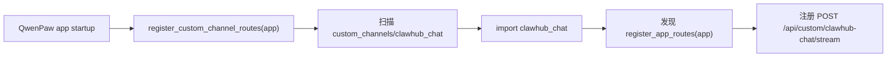
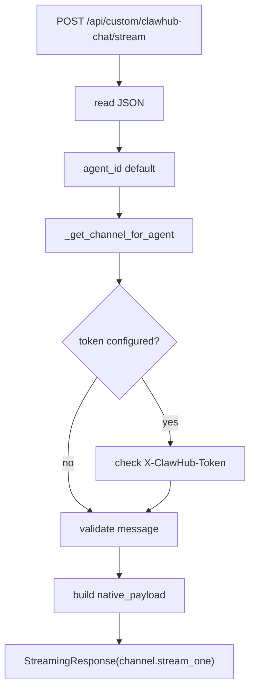
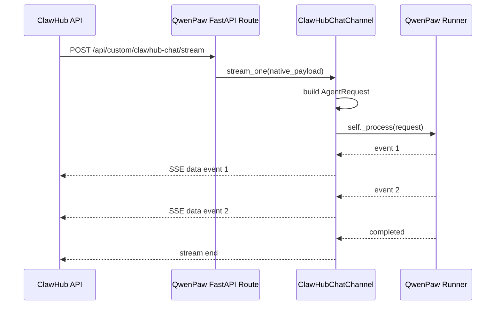

# clawhub_chat custom channel 源码阅读

日期：2026-05-12

## 1. 阅读目标

本文用于走读 `clawhub_chat` custom channel 的源码，帮助理解：

- 它为什么服务于 ClawHub 页面内聊天窗口。
- 它和 `cloud_edge` 的区别。
- 它如何通过 custom channel 注册 FastAPI 路由。
- 它为什么即使不在 `agent.json` 里启用，也能 route-only 工作。
- 它如何把 ClawHub 消息转成 QwenPaw AgentRequest。
- 它如何调用 runner.stream_query。
- 它如何把 QwenPaw runner 事件包装成 SSE 返回给 ClawHub。

核心源码位置：

```text
examples/custom_channels/clawhub_chat/
  channel.py
  channel.json
  README.zh.md
```

相关框架代码：

```text
src/qwenpaw/app/channels/base.py
src/qwenpaw/app/channels/registry.py
src/qwenpaw/app/channels/manager.py
src/qwenpaw/app/_app.py
src/qwenpaw/app/workspace/service_factories.py
```

安装脚本：

```text
scripts/install_clawhub_chat_channel.ps1
scripts/install_clawhub_chat_channel.sh
```

## 2. 总体定位

`clawhub_chat` 是云端 QwenPaw 容器给 ClawHub 控制台对话窗口使用的 custom channel。

它解决的问题是：

```text
用户在 ClawHub 页面里点击某只龙虾的“对话”；
ClawHub 不跳转到容器内部 QwenPaw 页面；
而是把用户消息转发给容器内 QwenPaw；
QwenPaw 流式执行并把事件返回给 ClawHub；
ClawHub 在自己的页面里展示对话。
```

它和 `cloud_edge` 不同：

| channel | 使用场景 | 网络方向 | 主要职责 |
|---|---|---|---|
| `clawhub_chat` | ClawHub 管理的云端 QwenPaw 容器 | ClawHub -> QwenPaw 容器 | 控制台页面聊天 |
| `cloud_edge` | 客户机房边侧 QwenPaw | 边侧 -> ClawHub | 注册、心跳、拉任务、回传 |

## 3. 目录结构

```text
examples/custom_channels/clawhub_chat/
  __init__.py
  channel.py
  channel.json
  README.zh.md
```

其中：

- `channel.py` 是核心实现。
- `channel.json` 是 channel 元信息。
- `README.zh.md` 是安装说明。

## 4. channel.json 阅读

```json
{
  "id": "clawhub_chat",
  "name": "ClawHub Chat Channel",
  "version": "0.1.0",
  "type": "custom_channel",
  "entry": "clawhub_chat.ClawHubChatChannel"
}
```

配置字段很少：

```text
enabled
token
```

这里有一个重要设计：

```text
clawhub_chat 的 HTTP route 只要 custom channel 被安装就会注册；
不一定要求 agent.json 里 channels.clawhub_chat.enabled = true。
```

如果配置了 `token`，ClawHub 调用时要带：

```text
X-ClawHub-Token
```

## 5. custom channel route 是怎么被注册的

入口在：

```text
src/qwenpaw/app/_app.py
```

应用启动时会调用：

```python
register_custom_channel_routes(app)
```

调用位置在 SPA fallback 之前：

```text
Custom channel routes
Console static files and SPA fallback
```

这是为了避免 custom route 被前端单页应用的 catch-all 路由吞掉。

`register_custom_channel_routes()` 位于：

```text
src/qwenpaw/app/channels/registry.py
```

它会扫描：

```text
~/.qwenpaw/custom_channels
```

如果模块里有：

```python
def register_app_routes(app):
    ...
```

就会调用这个 hook。

因此 `clawhub_chat` 不只是一个 channel class，还额外提供了 FastAPI route hook。

流程图：



## 6. 入口类 ClawHubChatChannel

源码：

```text
examples/custom_channels/clawhub_chat/channel.py
```

核心类：

```python
class ClawHubChatChannel(BaseChannel):
    channel = "clawhub_chat"
    uses_manager_queue = False
```

两个字段：

```text
channel = "clawhub_chat"
uses_manager_queue = False
```

`uses_manager_queue = False` 表示：

```text
它不走 ChannelManager 的异步消息队列；
ClawHub 调接口时，直接在 HTTP request 生命周期里 stream_one。
```

这和 `cloud_edge` 一样都不走 manager queue，但原因不同：

- `cloud_edge` 是自己启动后台 poll loop。
- `clawhub_chat` 是 FastAPI route 触发执行。

## 7. 初始化流程

构造函数：

```python
def __init__(self, process, config, on_reply_sent=None):
    super().__init__(process, on_reply_sent=on_reply_sent)
    self.config = self._normalize_config(config)
    self.enabled = bool(self.config.enabled)
```

重点：

- `process` 被 `BaseChannel` 存为 `self._process`。
- `config` 被 normalize 成 `SimpleNamespace`。
- `enabled` 只影响 channel manager 可见性，不影响 route 注册。

## 8. 配置 normalize

默认配置：

```text
enabled: false
bot_prefix: ""
filter_tool_messages: false
filter_thinking: false
token: ""
```

`token` 用于 ClawHub 调用时鉴权。

如果 token 为空，则不校验。

## 9. start / stop

```python
async def start(self):
    logger.info("clawhub_chat custom channel enabled/route-only")
```

`start()` 没有启动后台任务。

这是因为：

```text
clawhub_chat 不需要常驻 poll loop；
只需要 route 存在；
每次请求来了再执行。
```

`stop()` 也只是打日志。

## 10. health_check()

返回：

```text
channel: clawhub_chat
status: healthy
detail: ClawHub chat route is available.
```

注意：

```text
health_check 只能在 channel manager 中有该 channel 实例时看到。
```

如果没有在 `agent.json` 里启用 `channels.clawhub_chat`，route 仍然能工作，但 channel manager 的健康检查页可能看不到它。

这就是 README 里说的：

```text
复制目录后重启 QwenPaw 即可让 route 生效；
如果希望在 channel manager 里看到它，可在 agent.json 启用。
```

## 11. route-only fallback 是什么

`clawhub_chat` 最特殊的地方是 `_get_channel_for_agent()`。

源码逻辑：

```text
1. 从 app.state.multi_agent_manager 取 MultiAgentManager。
2. 根据 agent_id 获取 workspace。
3. 看 workspace.channel_manager 里有没有 clawhub_chat。
4. 如果有，返回已配置的 channel。
5. 如果没有，临时创建一个 ClawHubChatChannel：
   process = workspace.runner.stream_query
   config = {"enabled": True}
```

这叫 route-only fallback。

意思是：

```text
只要 custom channel 目录安装了，FastAPI route 就会注册；
即使 agent.json 没启用 clawhub_chat；
请求进来时也能临时创建 channel 对象，直接调用 runner。
```

优点：

- 云端容器开箱即用。
- 不需要用户手动配置 channel。
- ClawHub 创建实例后可以直接对话。

缺点：

- 如果没启用到 channel manager，健康检查和 channel 管理页不一定能看到。
- token 配置也依赖已配置 channel；fallback 默认 token 为空。

这也是为什么正式环境如果需要鉴权，建议启用配置：

```json
{
  "channels": {
    "clawhub_chat": {
      "enabled": true,
      "token": "..."
    }
  }
}
```

## 12. register_app_routes(app)

`register_app_routes()` 是模块级函数，不是类方法。

它注册：

```text
POST /api/custom/clawhub-chat/stream
```

这条 API 返回：

```text
text/event-stream
```

也就是 SSE。

为什么 route 必须在 `/api/` 下？

因为 QwenPaw 前端是 SPA，有 catch-all 路由。如果 custom route 不在 `/api/` 下，可能被前端静态页面 fallback 吞掉。

`registry.py` 也对此做了检查：如果 custom channel 注册了非 `/api/` route，会打 warning。

## 13. API 入参

ClawHub 调用：

```text
POST /api/custom/clawhub-chat/stream
```

请求 JSON 支持字段：

```text
agentId / agent_id
message
conversationId / conversation_id
senderId / sender_id
```

请求头：

```text
X-ClawHub-Token
```

示例：

```json
{
  "agentId": "default",
  "message": "你好，介绍一下你自己",
  "conversationId": "conv-001",
  "senderId": "user-001"
}
```

## 14. route 处理流程

`clawhub_chat_stream()` 做的事情：

```text
1. 读取 request.json。
2. 校验 payload 是 JSON object。
3. 读取 agent_id，默认 default。
4. 调用 _get_channel_for_agent(app, agent_id)。
5. 如果配置了 token，校验 X-ClawHub-Token。
6. 校验 message 非空。
7. 读取 conversation_id。
8. 读取 sender_id。
9. 构造 native_payload。
10. 返回 StreamingResponse(channel.stream_one(native_payload))。
```

流程图：



## 15. native_payload 结构

route 构造的 native payload：

```python
native_payload = {
    "message": message,
    "sender_id": sender_id,
    "meta": {
        "conversation_id": conversation_id,
        "source": "clawhub_chat",
    },
}
```

这不是 QwenPaw runtime 原生 AgentRequest。

它是 channel 自己定义的“入口 payload”，后面会通过 `build_agent_request_from_native()` 转成 AgentRequest。

## 16. build_agent_request_from_native()

这个方法负责：

```text
ClawHub payload -> AgentRequest
```

步骤：

```text
1. 读取 message/text。
2. 读取 sender_id，默认 clawhub。
3. 读取 meta。
4. resolve_session_id(sender_id, meta)。
5. 构造 TextContent。
6. 调用 BaseChannel.build_agent_request_from_user_content。
7. request.channel_meta = meta。
```

最终得到：

```text
channel = clawhub_chat
user_id = sender_id
session_id = conversation_id 或 clawhub:{sender_id}:default
input = 用户消息
```

## 17. session_id 规则

`resolve_session_id()` 优先读取：

```text
meta.conversation_id
meta.session_id
```

如果都没有，则使用：

```text
clawhub:{sender_id}:default
```

这说明：

- ClawHub 控制台应该始终传 `conversationId`。
- 这样 ClawHub 的会话 ID 和 QwenPaw 的 session_id 可以保持一致。
- 如果不传，会退化到默认会话，容易导致多个对话串在一起。

## 18. stream_one()

`stream_one()` 是真正执行 Agent 并流式返回的地方。

伪代码：

```text
request = build_agent_request_from_native(payload)
async for event in self._process(request):
    yield "data: {event_json}\n\n"
if on_reply_sent:
    on_reply_sent(...)
except Exception:
    yield error event
```

时序图：



## 19. self._process 到底是什么

`self._process` 来自 `BaseChannel.__init__(process)`。

对于配置启用的 channel：

```text
workspace/service_factories.py
  create_channel_service()
    ChannelManager.from_config(
      process=make_process_from_runner(runner)
    )
```

对于 route-only fallback：

```python
ClawHubChatChannel(
    process=workspace.runner.stream_query,
    config={"enabled": True},
)
```

所以 `clawhub_chat` 的执行核心都是：

```text
workspace.runner.stream_query(request)
```

这就是它和 QwenPaw Agent 真正连接的地方。

Java 类比：

```text
ClawHubChatChannel 是 Controller/Adapter；
workspace.runner.stream_query 是被注入的业务 Service；
AgentRequest 是 DTO；
SSE event 是响应流。
```

## 20. SSE 序列化

`stream_one()` 中每个 event 都会：

```python
yield f"data: {self._serialize_event_for_sse(event)}\n\n"
```

`_serialize_event_for_sse()` 来自 `BaseChannel`。

它会优先使用：

```text
event.model_dump_json()
event.json()
json.dumps({"text": str(event)})
```

并处理 surrogate 字符，避免 SSE 输出 JSON 时因非法字符失败。

ClawHub 侧收到的是标准 SSE：

```text
data: {"object":"message",...}

data: {"object":"content",...}

```

## 21. 错误处理

### 21.1 route 前置错误

例如 JSON 不是对象、message 为空、token 错误：

```text
直接抛 HTTPException
```

状态码可能是：

```text
400
401
503
```

### 21.2 stream 中执行错误

如果 `stream_one()` 执行过程中出错，不会让连接直接静默中断，而是返回一个 SSE error：

```json
{
  "object": "error",
  "message": "..."
}
```

这对 ClawHub UI 很重要，可以把错误展示在对话框里。

## 22. token 鉴权

逻辑：

```python
expected_token = channel.config.token
if expected_token and x_clawhub_token != expected_token:
    raise HTTPException(status_code=401)
```

说明：

- 如果 QwenPaw 侧配置 token，ClawHub 必须带。
- 如果 QwenPaw 侧 token 为空，不校验。

生产建议：

```text
云端容器实例创建时，由 ClawHub 生成随机 token。
写入容器 agent.json 或环境配置。
ClawHub 调用时带 X-ClawHub-Token。
```

## 23. send() 为什么是空实现

`ClawHubChatChannel.send()`：

```python
async def send(...):
    del to_handle, text, meta
    # request/stream based. Proactive sends are not part of this channel.
```

原因是：

```text
clawhub_chat 是请求-响应流模式；
只有 ClawHub 页面发起请求时，它才返回流。
```

主动上报类场景不适合走它。

如果是边侧 cron 或主动任务回传，应该走：

```text
cloud_edge.send()
```

这也是两个 channel 的边界：

```text
clawhub_chat: 页面问，容器答。
cloud_edge: 边侧主动轮询和主动上报。
```

## 24. 为什么它不走 ChannelManager queue

普通 IM channel 常见模式：

```text
收到 webhook -> enqueue -> queue consumer -> process -> send back
```

`clawhub_chat` 不适合这个模式，因为：

```text
HTTP 请求需要直接拿到 SSE 流；
如果丢到后台队列，就很难把实时事件流返回给当前 HTTP response。
```

所以它直接：

```text
HTTP request -> stream_one -> async for self._process -> StreamingResponse
```

这也是 `uses_manager_queue = False` 的原因。

## 25. 和 QwenPaw app 启动流程的关系

QwenPaw app 启动时：

```text
1. 创建 FastAPI app。
2. 创建 MultiAgentManager。
3. 启动配置里的 agents。
4. 注册 custom channel routes。
5. 注册静态页面和 SPA fallback。
```

`clawhub_chat` route 依赖：

```text
app.state.multi_agent_manager
```

所以 `_get_channel_for_agent()` 会在请求到来时动态从 `app.state` 取 manager，而不是在 route 注册时就取。

这避免了启动顺序问题：

```text
route 注册时 manager 可能还没完全 ready；
请求到来时再懒加载 workspace。
```

## 26. 和 ClawHub 的调用关系

ClawHub 后端应该负责：

```text
1. 根据用户选择的龙虾实例，找到容器访问地址。
2. 拼接 /api/custom/clawhub-chat/stream。
3. 带上 message、conversationId、senderId、agentId。
4. 如果配置 token，带 X-ClawHub-Token。
5. 接收 SSE。
6. 把 SSE 事件转发给 ClawHub 前端。
7. 同时落库为会话消息/事件。
```

ClawHub 前端不应该直接访问容器地址。

推荐链路：

```text
Browser -> ClawHub API -> QwenPaw Container
```

而不是：

```text
Browser -> QwenPaw Container
```

这样可以避免跨域、内网访问、鉴权、端口暴露等问题。

## 27. 调试方法

### 27.1 检查 route 是否注册

启动 QwenPaw 后，ClawHub 可以请求：

```text
POST http://container/api/custom/clawhub-chat/stream
```

如果返回 404，通常是：

- custom channel 没复制到 `~/.qwenpaw/custom_channels/clawhub_chat`。
- QwenPaw 没重启。
- route 没在 `/api/` 下。

### 27.2 检查 message 参数

如果返回：

```text
400 message is required
```

说明请求 JSON 没有 `message` 或为空。

### 27.3 检查 token

如果返回：

```text
401 Invalid ClawHub token
```

说明 QwenPaw 侧配置了 token，但 ClawHub 请求头不一致。

### 27.4 检查 agent_id

如果 agent 不存在，`multi_agent_manager.get_agent(agent_id)` 可能失败。

MVP 推荐始终传：

```text
agentId = default
```

### 27.5 检查 SSE

正常响应头：

```text
Content-Type: text/event-stream
Cache-Control: no-cache
X-Accel-Buffering: no
```

返回体形如：

```text
data: {"object":"message",...}

data: {"object":"response",...}
```

## 28. 当前边界与风险

### 28.1 route-only 方便但鉴权弱

如果不在 agent.json 启用 channel，fallback token 为空。

正式环境建议：

```text
显式启用 clawhub_chat；
写入 token；
ClawHub 转发时带 token。
```

### 28.2 会话主数据在 ClawHub

QwenPaw 内部也有 session 文件。

建议：

```text
ClawHub 作为会话列表和消息主数据；
QwenPaw session 作为执行上下文缓存。
```

否则会出现两个系统都有“最近对话”，且数据不一致。

### 28.3 文件能力尚未完整接入

当前源码只处理文本 message。

未来文件上传需要扩展 payload：

```text
files: [...]
```

并让 channel 把文件同步到 QwenPaw 工作目录，或传文件引用给 agent。

### 28.4 主动事件不走 clawhub_chat

cron、云边主动上报、系统事件不应该依赖 `clawhub_chat.send()`。

这些应走：

```text
cloud_edge
task_event
workspace_event
```

## 29. 和 cloud_edge 的对比

```text
clawhub_chat:
  ClawHub 页面发消息
  HTTP 请求进入 QwenPaw 容器
  同一个请求中返回 SSE
  适合云端容器控制台对话

cloud_edge:
  边侧 QwenPaw 后台主动运行
  注册/心跳/轮询任务
  事件主动 POST 回 ClawHub
  适合客户机房边侧节点
```

对比表：

| 维度 | clawhub_chat | cloud_edge |
|---|---|---|
| 发起方 | ClawHub | 边侧 QwenPaw |
| 是否有后台 loop | 否 | 是 |
| 是否注册 FastAPI route | 是 | 否 |
| 是否需要 manager queue | 否 | 否 |
| 主要协议 | HTTP + SSE | HTTP poll + POST events |
| 是否支持主动上报 | 否 | 是 |
| 使用场景 | 云端容器页面聊天 | 云边协同 |

## 30. 后续演进建议

### 30.1 补充文件输入

请求 payload 增加：

```json
{
  "files": [
    {
      "fileId": "file-1",
      "name": "sales.xlsx",
      "objectKey": "..."
    }
  ]
}
```

### 30.2 统一事件协议

和 `cloud_edge` 统一为：

```text
message event
tool event
terminal event
file event
task event
usage event
```

### 30.3 显式实例 token

ClawHub 创建容器时生成 token，并写入：

```text
channels.clawhub_chat.token
```

### 30.4 正式 plugin 化

当前是 custom channel。

未来如果 QwenPaw plugin 系统成熟，可以将它升级为：

```text
plugin + channel
```

提供：

- plugin.json。
- 插件管理页。
- 版本升级。
- 配置 schema。

## 31. 一句话总结

`clawhub_chat` 的本质是：

```text
ClawHub 控制台对话框到云端 QwenPaw 容器的流式 channel 适配器。
```

它不自己做 Agent，而是把 ClawHub 的页面消息转成 QwenPaw `AgentRequest`，调用：

```text
workspace.runner.stream_query
```

再把 runner events 通过 SSE 返回给 ClawHub。

它让用户留在 ClawHub 控制台里对话，隐藏容器 URL、端口和内部 QwenPaw UI，是 ClawHub 从“容器管理平台”走向“龙虾控制台”的关键一层。
