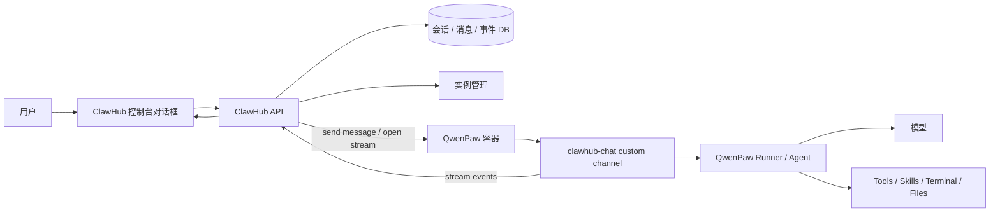
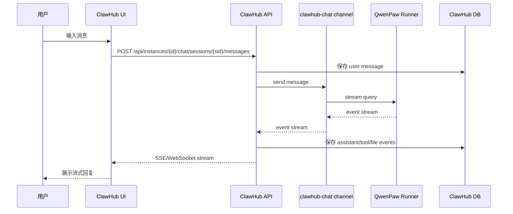

# ClawHub Chat Custom Channel 设计与竞品洞察

日期：2026-05-12

## 1. 背景

ClawHub 当前已经能创建和管理云端 QwenPaw 容器实例。用户点击“对话”时，希望在 ClawHub 控制台里直接和该实例对话，而不是跳转到容器内部 QwenPaw 页面，也不是让用户理解端口、iframe、容器 URL。

这引出一个核心设计问题：

```text
ClawHub 控制台的对话框，到底应该怎样接入容器内 QwenPaw？
```

有两种常见做法：

```text
方案 A：ClawHub 直接调用容器内部 chat API。
方案 B：在 QwenPaw 容器内增加 clawhub-chat custom channel，把 ClawHub 控制台作为一个 channel 接入。
```

本文建议采用方案 B：

```text
ClawHub 控制台 = 一个受控 chat channel
QwenPaw 实例 = 通过 clawhub-chat custom channel 接收消息、流式返回事件
```

这样做可以让 ClawHub 控制台对话、外部 IM channel、云边 channel 都统一到 QwenPaw 的 channel 模型里，减少对 QwenPaw 核心代码的侵入。

## 2. 先回答一个关键问题

其他几家的控制台是不是这样实现的？

公开资料无法看到 JVS Claw、Kimi Claw、ArkClaw、MaxClaw 的内部实现，所以不能断言它们就是用 custom channel 做的。

但从公开产品形态看，它们都体现了一个共同趋势：

```text
控制台对话入口不是孤立 UI，
而是一个连接到 Agent Runtime 的聊天入口。
```

尤其 Kimi Claw 明确支持：

- 在 Kimi 里创建云端 OpenClaw。
- 在 Kimi 里与 OpenClaw 对话。
- 将已有 OpenClaw 通过安装 Kimi 插件的方式接入 Kimi。

来源：[Kimi Claw 产品介绍](https://www.kimi.com/zh-cn/help/kimi-claw/overview)

这说明 Kimi 至少在产品层面把“Kimi 控制台”和“已有 OpenClaw 实例”做成了一种可连接关系。它内部可能是插件、channel、bridge 或私有协议，但产品语义和我们要做的 `clawhub-chat` 非常接近：

```text
平台控制台成为 OpenClaw/QwenPaw 的一个对话入口。
```

OpenClaw 公开文档也强调其支持大量 channel integrations，外部聊天平台通过 channel 接入 agent。参考：[OpenClaw Documentation](https://documentation.openclaw.ai/)

因此，我们不能说“竞品一定就是 custom channel”，但可以说：

```text
把控制台对话入口抽象成 channel，是符合 OpenClaw/QwenPaw 类产品架构趋势的。
```

## 3. 目标

`clawhub-chat` custom channel 的目标：

- 让 ClawHub 控制台可以直接和云端 QwenPaw 容器实例对话。
- 不要求用户打开容器内部 QwenPaw UI。
- 不把 ClawHub 的业务逻辑写进 QwenPaw 核心代码。
- 不依赖浏览器 iframe 嵌入容器页面。
- 支持流式返回 reasoning、message、tool、error 等事件。
- 支持会话隔离、最近对话、任务会话、文件卡片、执行详情。
- 为后续云边任务、定时任务、文件管理、终端事件统一打基础。

非目标：

- 不替代飞书、企业微信、Slack 等外部 channel。
- 不直接实现完整插件市场。
- 不要求用户理解 channel 配置。
- 不暴露容器端口、host、镜像等技术细节。

## 4. 总体架构



核心链路：

```text
ClawHub UI
  -> ClawHub API
  -> QwenPaw 容器内 clawhub-chat channel
  -> QwenPaw Runner
  -> 流式事件返回 ClawHub
  -> ClawHub UI 展示
```

## 5. 为什么不用 iframe 直接嵌容器页面

iframe 嵌入容器内 QwenPaw 页面短期最省事，但不是长期好方案。

问题包括：

- 浏览器安全策略可能阻止公网页面访问本地/内网地址。
- 容器 UI 与 ClawHub UI 风格割裂。
- 用户会看到两套产品。
- 会话、最近对话、文件、任务无法统一建模。
- 权限控制困难。
- 容器地址、端口、路径容易暴露。
- 多租户场景隔离复杂。

iframe 更像“临时调试入口”，不适合作为正式产品主交互。

## 6. 为什么不用 ClawHub 直接调用 QwenPaw 内部 Chat API

直接调用内部 Chat API 可以跑通，但长期会有几个问题：

### 6.1 绕过 channel 抽象

QwenPaw/OpenClaw 类系统的天然模型是：

```text
外部入口 -> channel -> runner -> agent
```

如果 ClawHub 直接调用内部 API，相当于绕过 channel：

```text
ClawHub -> runner/api -> agent
```

短期可行，但会导致：

- ClawHub 要理解 QwenPaw 内部请求格式。
- QwenPaw 内部 API 一变，ClawHub 就要跟着改。
- 会话隔离、用户身份、消息来源、事件流要在 ClawHub 重写。
- 后续外部 channel、云边 channel、控制台 channel 难统一。

### 6.2 不利于解耦

我们现在的原则是：

```text
尽量把 ClawHub 相关接入放在 custom channel 中。
```

这样新拉一个干净 QwenPaw 分支时，只需要合并 custom channel 目录和最少配置，就能跑起来。

### 6.3 不利于统一事件

对话框未来不仅展示文本，还要展示：

```text
reasoning
tool call
terminal stdout
file generated
task event
approval required
error
usage
```

这些更适合在 channel 层统一包装成事件流，而不是让 ClawHub 猜测 QwenPaw 内部格式。

## 7. clawhub-chat 的定位

`clawhub-chat` 是一个“平台控制台 channel”。

它和飞书 channel、企业微信 channel 的区别：

| channel | 入口 | 用户身份 | 消息来源 | 主要用途 |
|---|---|---|---|---|
| feishu | 飞书机器人 | 飞书用户 | IM 消息 | 企业 IM 对话 |
| wechat | 微信机器人 | 微信用户 | IM 消息 | 个人/企业聊天 |
| cloud_edge | ClawHub 云边通道 | 边侧节点 | 云边任务 | 云边协同 |
| clawhub-chat | ClawHub 控制台 | ClawHub 用户 | Web 对话框 | 云端实例控制台对话 |

它的特点：

- 用户身份由 ClawHub 认证。
- 会话归属由 ClawHub 管理。
- 消息存储在 ClawHub。
- QwenPaw 负责执行和生成。
- 事件流回传 ClawHub。

## 8. 设计原则

### 8.1 ClawHub 管产品态

ClawHub 负责：

- 用户登录。
- 租户隔离。
- 实例归属。
- 会话列表。
- 消息记录。
- 文件资产。
- 任务记录。
- 权限和审计。
- UI 展示。

### 8.2 QwenPaw 管执行态

QwenPaw 容器负责：

- Agent 执行。
- 模型调用。
- 工具调用。
- Skill 执行。
- 终端/浏览器/文件操作。
- 运行环境状态。

### 8.3 channel 管连接态

`clawhub-chat` 负责：

- 接收 ClawHub 消息。
- 规范化为 QwenPaw channel request。
- 调用 QwenPaw runner。
- 把 runner event 转换为 ClawHub event。
- 维护 session/channel/source 映射。

## 9. 通信模型

### 9.1 同容器 HTTP 模式

ClawHub 调用容器内 QwenPaw 的 `clawhub-chat` HTTP endpoint。

```text
ClawHub API
  -> http://container-host:port/api/channels/clawhub-chat/messages
```

优点：

- 实现简单。
- 易调试。
- 适合云端容器实例。

缺点：

- 需要容器端口可达。
- 要处理网络、反向代理、鉴权。

### 9.2 反向连接模式

容器内 `clawhub-chat` 主动连接 ClawHub，拉取消息并上报事件。

```text
QwenPaw clawhub-chat
  -> register
  -> poll messages
  -> post events
```

优点：

- 不要求 ClawHub 直接访问容器端口。
- 和云边 `cloud_edge` 模式一致。
- 更适合跨网络或严格隔离环境。

缺点：

- 实现复杂。
- 消息延迟取决于 polling 或长连接。

### 9.3 推荐

云端容器 MVP 可以先用同容器 HTTP 模式。

但接口设计应向反向连接模式兼容：

```text
message_id
session_id
channel_id
event_id
sequence
ack
```

这样后续可以复用到云边和边侧。

## 10. 消息流程



## 11. 会话模型

ClawHub 应该成为会话主数据方。

```text
chat_session
  id
  tenant_id
  user_id
  instance_id
  title
  session_type
  status
  created_at
  updated_at
```

`session_type`：

```text
NORMAL_CHAT
TASK_CHAT
CRON_TASK_CHAT
EDGE_CHAT
SYSTEM_REPAIR_CHAT
```

QwenPaw 内部也会有 session。需要做映射：

```text
clawhub_session_id <-> qwenpaw_session_id
```

建议 QwenPaw session id 使用可追踪命名：

```text
clawhub:{tenantId}:{instanceId}:{sessionId}
```

## 12. 事件模型

`clawhub-chat` 不应只返回最终文本，应返回统一事件：

```text
CHAT_MESSAGE
REASONING
TOOL_CALL
TOOL_RESULT
TERMINAL_COMMAND
TERMINAL_STDOUT
TERMINAL_STDERR
FILE_GENERATED
TASK_STARTED
TASK_PROGRESS
TASK_COMPLETED
ERROR
USAGE
```

事件结构：

```json
{
  "event_id": "evt_xxx",
  "session_id": "sess_xxx",
  "message_id": "msg_xxx",
  "sequence": 12,
  "event_type": "CHAT_MESSAGE",
  "source": "qwenpaw",
  "content": "好的，我开始处理。",
  "metadata": {},
  "created_at": "2026-05-12T10:00:00+08:00"
}
```

ClawHub UI 展示时可分层：

- 默认只展示用户消息、助手消息、文件卡片、任务状态。
- 高级模式展示 reasoning、tool、terminal、usage。

## 13. 文件与任务集成

`clawhub-chat` 不能只管文本。

### 13.1 文件输入

用户在 ClawHub 对话框上传文件：

```text
ClawHub 保存文件到 MinIO
登记 file_asset
把文件引用传给 clawhub-chat
clawhub-chat 将文件同步/挂载/下载到 QwenPaw 工作目录
Agent 读取文件
```

### 13.2 文件产物

QwenPaw 生成文件后：

```text
clawhub-chat 捕获 FILE_GENERATED event
上报 ClawHub
ClawHub 拉取或接收文件
登记 file_asset
UI 展示文件卡片
```

### 13.3 任务输入

如果用户创建定时任务、云边任务或长任务：

```text
ClawHub 创建 task
通过 clawhub-chat 下发给 QwenPaw
QwenPaw 执行
事件回写 task_event
结果回写会话
```

## 14. 安全设计

### 14.1 身份

ClawHub 调用 `clawhub-chat` 时必须带实例级 token：

```text
X-ClawHub-Instance-Token
X-ClawHub-User-Id
X-ClawHub-Tenant-Id
X-ClawHub-Session-Id
```

QwenPaw 只信任 ClawHub 签发的 token。

### 14.2 权限

ClawHub 先判断：

- 用户是否拥有实例。
- 用户是否能访问该会话。
- 用户是否能上传文件。
- 用户是否能执行高危任务。

QwenPaw 再判断：

- 工具是否允许。
- 文件是否允许读取。
- 终端命令是否需要审批。

### 14.3 审计

所有事件都应进入 ClawHub：

```text
用户消息
助手回复
工具调用
终端命令
文件读取
文件生成
任务创建
任务失败
模型用量
```

## 15. 和 cloud_edge 的关系

`clawhub-chat` 与 `cloud_edge` 是两条不同 channel，但设计上应复用事件模型。

| channel | 方向 | 用途 |
|---|---|---|
| clawhub-chat | ClawHub 控制台 -> 云端 QwenPaw 容器 | 用户和云端龙虾对话 |
| cloud_edge | 边侧 QwenPaw -> ClawHub | 云边任务、边侧注册、事件回传 |

二者共同点：

- 都是 ClawHub 与 QwenPaw 的连接层。
- 都应使用统一 event 格式。
- 都应能把结果写回 ClawHub 会话。
- 都应支持任务、文件、流式事件。

差异：

- `clawhub-chat` 面向云端容器实例。
- `cloud_edge` 面向客户生产网络边侧节点。

后续可以抽象公共协议：

```text
ClawHub Agent Channel Protocol
  message
  event
  task
  file
  ack
```

## 16. 竞品洞察

### 16.1 JVS Claw

JVS Claw 的产品形态是：

```text
左侧 Clawbot
中间对话
右侧/全屏 ClawSpace 云端环境
```

公开文档强调：

- 点击 Clawbot 卡片上的“对话”进入深度协同界面。
- 对话区域可以输入需求。
- 系统实时显示 AI 在云端环境的操作链路。
- ClawSpace 是独立云端环境。

来源：[JVS Claw 功能介绍](https://docs-jvs.wuying.com/zh/docs/intro/feature/)

洞察：

JVS 大概率不是简单 iframe 一个原生 OpenClaw 页面，而是把“对话 + 执行画面 + 文件 + 任务”包装成统一控制台体验。内部是否用 channel 不可知，但产品语义是：

```text
控制台对话入口和云端执行环境深度绑定。
```

这支持我们做 `clawhub-chat`。

### 16.2 Kimi Claw

Kimi Claw 明确支持：

- 在 Kimi 中创建云端 OpenClaw。
- 在 Kimi 中与 OpenClaw 对话。
- 通过安装 Kimi 插件，把已有 OpenClaw 接入 Kimi。

来源：[Kimi Claw 产品介绍](https://www.kimi.com/zh-cn/help/kimi-claw/overview)

洞察：

Kimi 最接近 `clawhub-chat` 的思想。

它的产品语义可以抽象为：

```text
Kimi 控制台 = OpenClaw 的上层 chat surface
Kimi 插件/连接层 = existing OpenClaw 到 Kimi 的 bridge/channel
```

所以我们做：

```text
ClawHub 控制台 = QwenPaw 的上层 chat surface
clawhub-chat custom channel = QwenPaw 到 ClawHub 的 bridge/channel
```

是合理的。

### 16.3 ArkClaw

ArkClaw 更偏企业 SaaS，强调免运维、飞书/钉钉入口、安全和云端托管。

洞察：

ArkClaw 类型产品不会让用户感知容器内部 UI，而会把控制台、IM、企业工具包装成统一入口。

这意味着 ClawHub 也不应该把用户带进容器原生页面，而应该在 ClawHub 内完成：

```text
对话
任务
文件
修复
升级
云边
```

### 16.4 MaxClaw

MaxClaw 强调：

- 无服务器。
- 无 Docker。
- 无 API Key。
- 云工作空间。
- 多 IM 入口。
- 托管 Agent runtime。

来源：[MiniMax MaxClaw](https://agent.minimax.io/activity/max-claw)

洞察：

MaxClaw 的方向是“用户只面对 Agent，不面对运行环境”。这也说明 ClawHub 需要把容器 UI 藏起来。

用户应该看到：

```text
我的龙虾
对话
文件
任务
升级
修复
```

而不是：

```text
打开 18088 端口的 QwenPaw 页面
```

## 17. MVP 实现建议

### 17.1 QwenPaw 侧

新增 custom channel：

```text
examples/custom_channels/clawhub_chat/
```

能力：

- 提供 `/messages` 或 `/stream` endpoint。
- 接收 ClawHub message。
- 调用 runner.stream_query。
- 将事件转换为 ClawHub event。
- 支持 session id 映射。
- 支持基本 token 校验。

### 17.2 ClawHub 侧

新增：

- 会话表。
- 消息表。
- 事件表。
- 实例 chat endpoint。
- SSE 或 WebSocket 流式返回。
- 最近对话列表。
- 文件卡片预留。
- 任务卡片预留。

### 17.3 协议 MVP

请求：

```json
{
  "tenant_id": "tenant-1",
  "user_id": "user-1",
  "instance_id": "inst-1",
  "session_id": "sess-1",
  "message_id": "msg-1",
  "content": "你好，介绍一下你自己",
  "metadata": {}
}
```

响应事件：

```json
{
  "event_type": "CHAT_MESSAGE",
  "sequence": 1,
  "content": "你好，我是你的云端龙虾。",
  "metadata": {}
}
```

## 18. 风险与取舍

| 风险 | 说明 | 建议 |
|---|---|---|
| custom channel 仍不是正式 plugin | 没有 plugin.json、插件市场、启停 UI | MVP 可接受，后续演进 plugin |
| QwenPaw 内部 runner 事件格式变化 | channel 需要适配 | 在 clawhub-chat 内做 adapter |
| ClawHub 与容器通信失败 | 网络、端口、容器异常 | 统一错误事件和修复入口 |
| 会话双写不一致 | ClawHub 和 QwenPaw 都有 session | ClawHub 作为主数据，QwenPaw 为执行映射 |
| 文件同步复杂 | 文件在 MinIO、容器、边侧多处 | MVP 先文本，文件预留协议 |
| 安全风险 | 控制台可触发工具和终端 | token、权限、命令护栏、审计 |

## 19. 路线图

### V0

- 控制台文本对话。
- 流式回复。
- 会话列表。
- 最近对话。
- 基础鉴权。

### V1

- 工具事件展示。
- 文件上传和产物卡片。
- 任务事件。
- 定时任务会话。
- 错误诊断。

### V2

- 与 `cloud_edge` 统一事件协议。
- 支持云边任务结果回写同一会话。
- 支持终端执行详情。
- 支持权限审计。

### V3

- 抽象为正式插件。
- 支持插件管理页面。
- 支持多版本协议。
- 支持企业租户级策略。

## 20. 结论

`clawhub-chat` custom channel 的本质是：

```text
把 ClawHub 控制台变成 QwenPaw 的一个官方聊天入口。
```

它不是简单 UI 转发，也不是 iframe 嵌套，而是一个平台级 channel。

这样做的价值：

- 保持 QwenPaw 核心代码解耦。
- 统一控制台对话、事件、文件、任务。
- 为云边协同复用事件模型。
- 隐藏容器细节，提升产品化体验。
- 和 Kimi/JVS/Ark/Max 这类托管 Claw 产品的方向一致。

最重要的判断是：

```text
ClawHub 不应该只是容器管理平台。
ClawHub 应该成为龙虾的控制台。
控制台对话框本身，就应该是一个 channel。
```

## 21. 参考资料

- [Kimi Claw 产品介绍](https://www.kimi.com/zh-cn/help/kimi-claw/overview)
- [Kimi Claw 1-click OpenClaw Cloud Deployment](https://www.kimi.com/resources/kimi-claw-introduction)
- [OpenClaw Documentation](https://documentation.openclaw.ai/)
- [JVS Claw 功能介绍](https://docs-jvs.wuying.com/zh/docs/intro/feature/)
- [MiniMax MaxClaw](https://agent.minimax.io/activity/max-claw)
