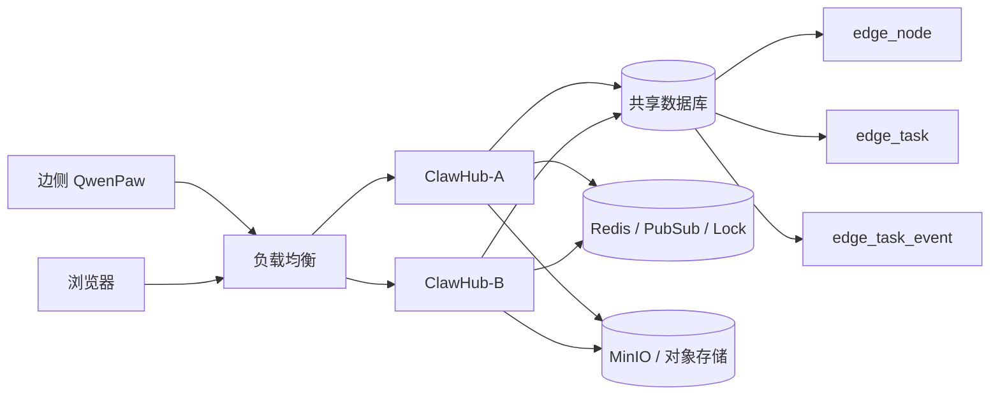

# ClawHub 多实例部署下的云边协同改造设计

日期：2026-05-13

## 1. 背景

当前 ClawHub 已支持通过 `cloud_edge` custom channel 与边侧 QwenPaw 通信：

```text
边侧 QwenPaw -> ClawHub 注册
边侧 QwenPaw -> ClawHub 心跳
边侧 QwenPaw -> ClawHub 拉取任务
边侧 QwenPaw -> ClawHub 上报任务事件
边侧 QwenPaw -> ClawHub 上报任务完成结果
```

这套链路在单实例 ClawHub 下可以跑通。但如果 ClawHub 未来双实例或多实例部署，就会出现新的分布式问题。

例如：

```text
边侧 register 请求到了 ClawHub-A
heartbeat 请求到了 ClawHub-B
poll 请求到了 ClawHub-A
event 上报到了 ClawHub-B
用户浏览器 SSE/WebSocket 连着 ClawHub-A
```

如果节点状态、任务状态、事件流依赖某个 ClawHub 进程内存，那么多实例后会出现：

- 节点在线状态不一致。
- 同一个任务被重复领取。
- 任务事件落在另一个实例，当前页面收不到。
- SSE/WebSocket 连接实例和事件接收实例不一致。
- 后台定时任务重复执行。
- 实例重启导致状态丢失。

因此，需要把 ClawHub 从“单进程状态模型”改造成“共享状态 + 无状态 API + 分布式任务事件模型”。

## 2. 设计目标

本设计目标：

- 支持 ClawHub API 多实例水平扩展。
- 边侧 QwenPaw 可以请求任意 ClawHub 实例。
- 节点在线状态在多实例间一致。
- 任务只能被一个边侧节点领取一次。
- 任务事件不会因请求落到不同 ClawHub 实例而丢失。
- 云端页面可以看到完整任务流式结果。
- ClawHub 实例重启不影响任务状态。
- 为后续灰度、HA、K8s 部署预留能力。

非目标：

- 本文不设计完整 K8s 部署方案。
- 本文不改造 QwenPaw `cloud_edge` channel 协议本身。
- 本文不要求第一版必须引入 MQ。
- 本文不要求第一版实现严格实时流式推送。

## 3. 核心原则

### 3.1 ClawHub API 实例尽量无状态

ClawHub 多实例后，每个 API 实例不应该保存关键业务状态。

不能依赖内存保存：

```text
边侧节点在线状态
任务队列
任务领取状态
任务事件
用户会话事件
SSE 待推送缓存
```

这些状态必须进入共享存储：

```text
数据库
Redis
MQ
对象存储
```

### 3.2 数据库是任务状态主存储

云边任务必须以数据库为准。

任务状态变化：

```text
PENDING -> LEASED -> RUNNING -> SUCCEEDED / FAILED / TIMEOUT
```

必须通过数据库事务、乐观锁或原子 update 保证一致性。

### 3.3 事件先落库，再推送

边侧执行事件不要只推给当前连接的前端。

正确顺序：

```text
边侧 POST event
ClawHub 写 task_event 表
ClawHub 再通知前端
```

这样即使推送失败，用户刷新页面也能从数据库恢复完整事件。

### 3.4 实时能力可以逐步演进

多实例下实时事件推送有复杂度。

MVP 可以先采用：

```text
事件落库 + 前端轮询
```

成熟版再升级为：

```text
事件落库 + Redis Pub/Sub / MQ + SSE/WebSocket 推送
```

## 4. 当前风险分析

### 4.1 节点状态风险

如果当前边侧节点在线状态只存在 Java 进程内存：

```text
register 到 A，A 认为在线；
heartbeat 到 B，B 认为在线；
A/B 查询结果可能不一致。
```

风险：

- 页面显示不稳定。
- 一会儿在线，一会儿离线。
- 下发任务时选错节点。

改造要求：

```text
edge_node 表记录 last_seen_at。
在线状态根据 now - last_seen_at 计算。
```

### 4.2 任务重复领取风险

多实例下，两个请求可能同时 poll 到同一个 pending 任务。

风险：

```text
同一个任务被执行两次。
同一个任务结果被覆盖。
用户看到重复消息。
边侧执行产生副作用。
```

改造要求：

```text
任务领取必须是数据库原子操作。
```

### 4.3 事件流丢失风险

用户页面连接 ClawHub-A，但边侧事件 POST 到 ClawHub-B。

如果事件只存在 B 的内存，A 的页面收不到。

改造要求：

```text
事件必须落库。
页面读取事件以数据库为准。
```

### 4.4 后台任务重复执行风险

如果 ClawHub 自己有后台定时任务：

- 节点离线扫描。
- 超时任务扫描。
- 自动备份。
- 自动升级。
- 清理任务。

多实例下可能每个实例都执行一遍。

改造要求：

```text
后台任务需要分布式锁。
```

## 5. 目标架构



关键点：

- 边侧请求任意 ClawHub 实例都可以。
- 用户请求任意 ClawHub 实例都可以。
- 节点、任务、事件全部进入共享数据库。
- Redis 用于实时通知、分布式锁、短期缓存。
- MinIO 用于文件、备份、任务产物。

## 6. 数据模型改造

### 6.1 edge_node 表

建议字段：

```text
id
tenant_id
node_id
group_name
username
host_ip
port
os_name
arch
qwenpaw_version
capabilities_json
metadata_json
status
last_seen_at
registered_at
updated_at
last_seen_instance
```

说明：

- `node_id` 在租户内唯一。
- `last_seen_at` 是判断在线的关键字段。
- `status` 可以缓存状态，但最终应根据 `last_seen_at` 计算。
- `last_seen_instance` 记录最后处理该节点心跳的 ClawHub 实例，便于排障。

唯一索引：

```text
tenant_id + node_id
```

在线判断：

```text
now - last_seen_at <= heartbeat_timeout
```

不要依赖内存里的 online map。

### 6.2 edge_task 表

建议字段：

```text
id
tenant_id
user_id
conversation_id
node_id
task_type
title
instruction
status
priority
timeout_seconds
max_attempts
attempts
lease_owner
lease_until
created_at
updated_at
started_at
finished_at
result_json
error_message
version
```

核心字段：

- `status`
- `lease_owner`
- `lease_until`
- `attempts`
- `version`

状态：

```text
PENDING
LEASED
RUNNING
SUCCEEDED
FAILED
CANCELED
TIMEOUT
```

### 6.3 edge_task_event 表

建议字段：

```text
id
tenant_id
task_id
conversation_id
node_id
sequence
event_type
content
raw_event_json
created_at
received_instance
```

唯一索引：

```text
task_id + sequence
```

用途：

- 保证事件顺序。
- 避免重复上报。
- 支持页面刷新后恢复。
- 支持审计。

### 6.4 conversation_event 表

如果 ClawHub 已经有统一会话事件表，可以把云边事件同步写入：

```text
conversation_event
  id
  conversation_id
  source
  event_type
  content
  task_id
  created_at
```

这样云边任务结果可以直接显示在同一个对话里。

## 7. API 改造设计

### 7.1 注册接口

```text
POST /api/edge/nodes/register
```

改造要求：

- 使用 upsert。
- 根据 `tenant_id + node_id` 更新或插入节点。
- 更新 `last_seen_at`。
- 更新节点能力和版本。
- 不写内存状态。

伪代码：

```text
upsert edge_node
  set last_seen_at = now
      status = ONLINE
      last_seen_instance = current_instance_id
```

### 7.2 心跳接口

```text
POST /api/edge/nodes/heartbeat
```

改造要求：

- 只更新共享 DB。
- 不依赖当前实例内存。
- 可适当写 Redis 缓存，但 DB 是主状态。

### 7.3 拉取任务接口

```text
POST /api/edge/tasks/poll
```

这是最关键的接口。

必须保证原子领取。

目标语义：

```text
一个 PENDING 任务只能被一个 poll 请求领取。
```

推荐 SQL 语义：

```sql
UPDATE edge_task
SET status = 'LEASED',
    lease_owner = :nodeId,
    lease_until = :nowPlusTimeout,
    attempts = attempts + 1,
    updated_at = :now
WHERE id = (
    SELECT id
    FROM edge_task
    WHERE tenant_id = :tenantId
      AND node_id = :nodeId
      AND status = 'PENDING'
    ORDER BY priority DESC, created_at ASC
    LIMIT 1
)
AND status = 'PENDING';
```

不同数据库语法不一样，核心是：

```text
查询候选任务 + 原子更新状态
```

如果用 JPA，可以考虑：

- 悲观锁 `SELECT ... FOR UPDATE`。
- 乐观锁 `version`。
- 原子 `UPDATE ... WHERE status='PENDING'`。

### 7.4 任务事件接口

```text
POST /api/edge/tasks/{taskId}/events
```

改造要求：

```text
1. 校验 task 存在。
2. 校验 node_id 与任务匹配。
3. 插入 edge_task_event。
4. 同步写 conversation_event。
5. 发布 Redis Pub/Sub 通知。
```

如果 event 重复上报：

```text
task_id + sequence 唯一约束
```

可以做到幂等。

### 7.5 任务完成接口

```text
POST /api/edge/tasks/{taskId}/complete
```

改造要求：

- 只有持有 lease 的 node 可以完成任务。
- 完成时写最终状态和 result。
- 写 conversation_event。
- 发布任务完成通知。

校验：

```text
task.lease_owner == node_id
task.status in (LEASED, RUNNING)
```

## 8. 任务 lease 机制

### 8.1 为什么需要 lease

边侧 poll 到任务后，可能出现：

- 边侧执行中宕机。
- 网络中断。
- 任务执行超时。
- complete 请求失败。

如果没有 lease，任务会永远卡在 running。

### 8.2 lease 字段

```text
lease_owner = node_id
lease_until = 当前时间 + timeout
attempts = attempts + 1
```

### 8.3 lease 过期处理

后台扫描：

```text
status in (LEASED, RUNNING)
and lease_until < now
```

处理策略：

```text
如果 attempts < max_attempts:
  status = PENDING
  lease_owner = null
  lease_until = null
else:
  status = TIMEOUT
```

该扫描任务多实例下必须加分布式锁。

## 9. 前端事件展示方案

多实例下有两种方案。

### 9.1 MVP：前端轮询

页面定时请求：

```text
GET /api/edge/tasks/{taskId}/events?afterSequence=10
```

优点：

- 简单。
- 不怕事件落到不同 ClawHub 实例。
- 不需要 Redis Pub/Sub。
- 页面刷新可恢复。

缺点：

- 不是严格实时。
- 有额外请求。

适合 MVP。

### 9.2 进阶：Redis Pub/Sub + SSE/WebSocket

流程：

```text
边侧 event POST 到 ClawHub-B
ClawHub-B 写 DB
ClawHub-B publish Redis channel
ClawHub-A 收到 Redis message
ClawHub-A 推给连接在 A 上的浏览器
```

优点：

- 实时性好。
- 用户体验好。

缺点：

- 复杂度高。
- 需要管理连接和订阅。
- Redis 故障时要 fallback 到 DB。

推荐：

```text
第一版先轮询；
第二版再 Redis Pub/Sub。
```

## 10. ClawHub 实例身份

多实例排障时需要知道哪个实例处理了请求。

建议每个 ClawHub 实例启动时生成或配置：

```text
CLAWHUB_INSTANCE_ID
```

例如：

```text
clawhub-api-001
clawhub-api-002
```

写入：

- `edge_node.last_seen_instance`
- `edge_task_event.received_instance`
- 日志 MDC。

便于排查：

```text
这个任务是谁领取的？
这个事件是哪个实例收到的？
节点最后心跳到了哪个实例？
```

## 11. 分布式锁

需要分布式锁的场景：

- 超时任务扫描。
- 节点离线状态刷新。
- 自动备份。
- 自动升级。
- 定时清理。
- 系统统计任务。

推荐用 Redis lock：

```text
SET lock_key value NX EX 60
```

或者使用成熟库：

- Redisson。
- ShedLock。

MVP 如果没有这些后台任务，可以先不引入锁，但代码结构要预留。

## 12. 部署形态

### 12.1 单机 Docker 双实例

```text
clawhub-a
clawhub-b
mysql/postgres
redis
nginx
```

Nginx/LB：

```text
/api -> clawhub-a or clawhub-b
```

### 12.2 K8s

```text
Deployment: clawhub-api replicas=2
Service: clawhub
Ingress: external access
DB: managed database
Redis: managed redis
MinIO/OSS: object storage
```

边侧 QwenPaw 不关心后面有几个 ClawHub 实例，只访问：

```text
https://clawhub.example.com
```

## 13. 对现有代码的改造清单

以下是建议改造点，不是当前执行项。

### 13.1 节点管理

改造目标：

```text
所有节点状态落库。
在线状态按 last_seen_at 计算。
```

改造内容：

- 新增或完善 `edge_node` 表。
- register 改成 upsert。
- heartbeat 只更新 DB。
- 查询节点列表时根据 `last_seen_at` 计算 online/offline。
- 不使用本地内存 Map 保存在线节点。

### 13.2 任务管理

改造目标：

```text
任务拉取具备原子 lease。
```

改造内容：

- 完善 `edge_task` 表字段。
- poll 接口使用事务或乐观锁。
- complete 接口校验 lease_owner。
- 增加 lease 过期恢复逻辑。
- 增加 attempts/max_attempts。

### 13.3 事件管理

改造目标：

```text
事件先落库，再推送。
```

改造内容：

- 新增 `edge_task_event` 表。
- event 接口插入事件表。
- 增加 `task_id + sequence` 唯一索引。
- 同步写入会话事件表。
- 前端支持按 sequence 拉取增量事件。

### 13.4 前端显示

改造目标：

```text
任务流式结果不依赖当前 ClawHub 实例内存。
```

MVP：

- 前端定时轮询 task events。
- 按 sequence 追加展示。
- 页面刷新后从 DB 恢复。

后续：

- SSE/WebSocket。
- Redis Pub/Sub。

### 13.5 后台任务

改造目标：

```text
多实例下后台任务不重复执行。
```

改造内容：

- 引入 Redis/ShedLock。
- 超时任务扫描加锁。
- 离线节点扫描加锁。
- 清理任务加锁。

### 13.6 配置

新增配置：

```yaml
clawhub:
  instance-id: ${CLAWHUB_INSTANCE_ID:}
  edge:
    node-offline-seconds: 90
    task-lease-seconds: 900
    poll-empty-response-delay-ms: 0
  realtime:
    mode: polling # polling / redis-pubsub
```

## 14. 数据一致性策略

### 14.1 幂等

这些接口要幂等：

```text
register
heartbeat
task event
task complete
```

实现方式：

- register 使用 upsert。
- heartbeat 更新 same node。
- event 使用 `task_id + sequence` 唯一约束。
- complete 对已完成任务返回当前结果，不重复覆盖。

### 14.2 重试

边侧可能因为网络失败重试 event 或 complete。

ClawHub 必须能接受重复请求。

### 14.3 顺序

事件顺序以：

```text
task_id + sequence
```

为准。

如果出现乱序，前端按 sequence 排序。

## 15. 安全设计

多实例不改变安全模型，但需要统一鉴权。

建议：

- 所有实例使用同一套 token 校验密钥。
- 边侧 token 存 DB 或安全配置。
- 不把 token 存某个实例内存。
- 请求日志不要打印 token。
- event/complete 要校验 node_id 与 task 归属。

## 16. 监控指标

需要增加指标：

```text
edge_node_online_count
edge_node_heartbeat_total
edge_task_pending_count
edge_task_leased_count
edge_task_timeout_count
edge_task_duplicate_event_count
edge_task_poll_empty_total
edge_task_poll_hit_total
edge_task_event_total
edge_task_complete_total
```

日志建议带：

```text
instance_id
tenant_id
node_id
task_id
conversation_id
sequence
```

## 17. MVP 落地顺序

### 第一阶段：数据库状态化

- 节点状态落库。
- 任务状态落库。
- 事件落库。
- 前端轮询事件。
- 任务领取原子 lease。

这一阶段完成后，ClawHub 双实例基本可用。

### 第二阶段：稳定性增强

- lease 超时恢复。
- attempts 重试。
- 幂等 event/complete。
- 后台扫描分布式锁。

### 第三阶段：实时体验增强

- Redis Pub/Sub。
- SSE/WebSocket 多实例推送。
- 页面实时流式效果恢复。

### 第四阶段：企业化

- 任务审计。
- 操作日志。
- 监控告警。
- 节点分组路由。
- 多租户隔离增强。

## 18. 对 cloud_edge channel 是否需要改

理想情况下，`cloud_edge` channel 本身不需要大改。

原因：

```text
它已经是边侧主动请求 ClawHub。
它不关心 ClawHub 后面是一个实例还是多个实例。
```

但可能需要增强：

- event/complete 失败时有限重试。
- 上报 event 时保证 sequence 单调。
- poll 返回空任务时支持服务端建议下次 poll 间隔。
- token 支持刷新或签名。

核心改造主要在 ClawHub 后端。

## 19. 结论

当前云边 channel 的“边侧主动调云”方向是正确的，它天然适合客户机房和多实例 ClawHub。

但要真正支持 ClawHub 双实例或多实例，必须做到：

```text
节点状态落库；
任务领取原子 lease；
事件先落库再推送；
前端不依赖单实例内存；
后台任务加分布式锁；
所有接口幂等。
```

MVP 推荐策略：

```text
共享数据库 + DB lease + 事件落库 + 前端轮询
```

成熟版再升级为：

```text
共享数据库 + Redis Pub/Sub + SSE/WebSocket + 分布式锁
```

一句话总结：

```text
多实例问题不是 cloud_edge channel 的方向问题，
而是 ClawHub 后端状态管理必须从单机内存模型升级为共享状态模型。
```
