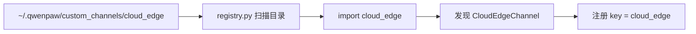
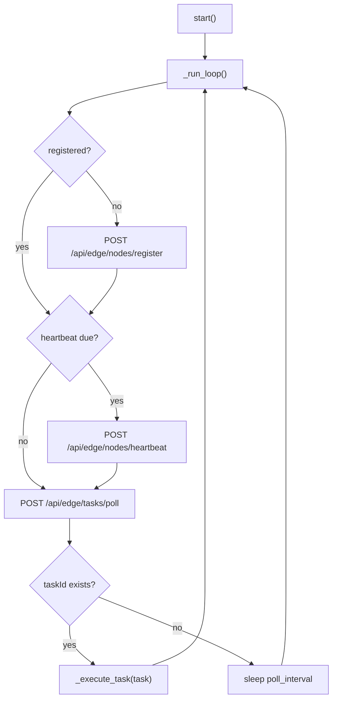
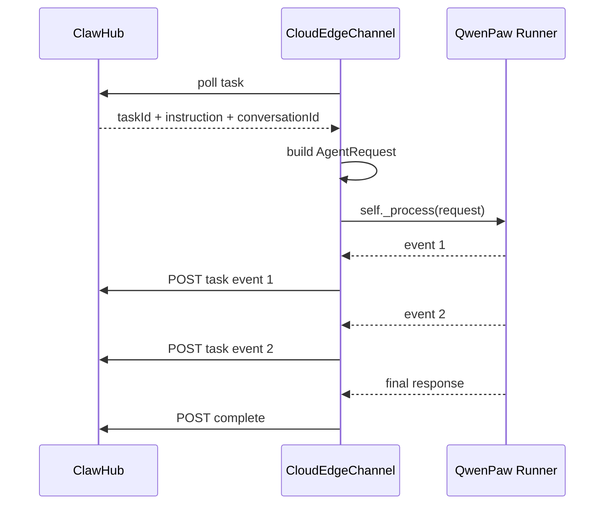

# cloud_edge custom channel 源码阅读

日期：2026-05-12

## 1. 阅读目标

本文用于走读 `cloud_edge` custom channel 的源码，帮助理解：

- 它为什么是“边侧主动访问云端”。
- 它如何注册、心跳、轮询任务。
- 它如何把云端下发的任务转成 QwenPaw AgentRequest。
- 它如何调用 QwenPaw Runner 执行。
- 它如何把流式事件和最终结果回传给 ClawHub。
- 它如何支撑边侧原生 cron 定时任务回传。

核心源码位置：

```text
examples/custom_channels/cloud_edge/
  channel.py
  channel.json
  README.zh.md
```

相关框架代码：

```text
src/qwenpaw/app/channels/base.py
src/qwenpaw/app/channels/registry.py
src/qwenpaw/app/channels/manager.py
src/qwenpaw/app/workspace/service_factories.py
src/qwenpaw/app/crons/executor.py
```

安装脚本：

```text
scripts/install_cloud_edge_channel.ps1
scripts/install_cloud_edge_channel.sh
```

## 2. 总体定位

`cloud_edge` 是边侧 QwenPaw 使用的 custom channel。

它的网络方向是：

```text
边侧 QwenPaw -> ClawHub
```

也就是说，它不要求 ClawHub 能访问边侧机器端口。边侧只需要能访问 ClawHub 的 HTTPS/HTTP 地址。

这正好满足客户机房常见约束：

```text
客户机房不开放入站端口；
边侧只能主动出站访问云端；
云端通过任务队列间接下发意图。
```

## 3. 目录结构

```text
examples/custom_channels/cloud_edge/
  __init__.py
  channel.py
  channel.json
  README.zh.md
```

其中最核心的是：

```text
channel.py
```

`channel.json` 是 channel 元信息和配置字段声明。

`README.zh.md` 是安装和使用说明。

## 4. channel.json 阅读

`channel.json` 定义了：

```json
{
  "id": "cloud_edge",
  "name": "Cloud Edge Channel",
  "version": "0.1.0",
  "type": "custom_channel",
  "entry": "cloud_edge.CloudEdgeChannel"
}
```

关键点：

- `id` 是 channel 名称，对应代码里的 `CloudEdgeChannel.channel = "cloud_edge"`。
- `entry` 表示入口类是 `cloud_edge.CloudEdgeChannel`。
- `type` 表示这是一个 custom channel，不是内置 channel，也不是 plugin。

配置字段包括：

```text
enabled
hub_url
node_id
tenant_id
group_name
username
token
heartbeat_interval
poll_interval
```

其中必填的是：

```text
hub_url
node_id
tenant_id
group_name
```

这些字段会进入边侧 QwenPaw 的 `agent.json`：

```json
{
  "channels": {
    "cloud_edge": {
      "enabled": true,
      "hub_url": "http://127.0.0.1:8080",
      "node_id": "edge-linux-001",
      "tenant_id": "tenant-a",
      "group_name": "default"
    }
  }
}
```

## 5. custom channel 是怎么被 QwenPaw 发现的

入口在：

```text
src/qwenpaw/app/channels/registry.py
```

`CUSTOM_CHANNELS_DIR` 来自：

```text
src/qwenpaw/constant.py
```

实际目录是：

```text
${QWENPAW_WORKING_DIR}/custom_channels
```

如果没有显式设置 `QWENPAW_WORKING_DIR`，默认是：

```text
~/.qwenpaw/custom_channels
```

`_discover_custom_channels()` 会扫描这个目录：

```text
custom_channels/cloud_edge/__init__.py
custom_channels/cloud_edge/channel.py
```

只要模块里存在 `BaseChannel` 子类，并且类上有 `channel` 字段，就会注册进 channel registry。

简化理解：



## 6. ChannelManager 是怎么创建 cloud_edge 的

创建入口在：

```text
src/qwenpaw/app/workspace/service_factories.py
```

`create_channel_service()` 会做几件事：

```text
1. 读取 workspace 的 agent 配置。
2. 把 channels 配置包装成临时 Config。
3. 取出当前 workspace 的 runner。
4. 调用 ChannelManager.from_config(...)
5. 把 runner.stream_query 包装成 process 传给 channel。
```

关键代码语义是：

```text
process = make_process_from_runner(runner)
```

然后：

```text
ChannelManager.from_config(process=process, config=temp_config)
```

对 `cloud_edge` 来说，这意味着：

```text
CloudEdgeChannel 内部的 self._process
就是当前边侧 QwenPaw agent 的 stream_query 执行入口。
```

Java 程序员类比：

```text
ChannelManager 像 Spring 容器里的 Bean Factory。
CloudEdgeChannel 是一个 Bean。
runner.stream_query 像被注入进来的 Service 方法引用。
```

## 7. CloudEdgeChannel 类结构

源码：

```text
examples/custom_channels/cloud_edge/channel.py
```

核心类：

```python
class CloudEdgeChannel(BaseChannel):
    channel = "cloud_edge"
    uses_manager_queue = False
```

两个关键字段：

```text
channel = "cloud_edge"
uses_manager_queue = False
```

`channel` 是 channel ID。

`uses_manager_queue = False` 很重要。它表示：

```text
cloud_edge 不使用 ChannelManager 的统一队列消费模型。
它自己在 start() 里启动后台 loop，自己注册、心跳、poll、执行任务。
```

这和飞书、钉钉这种接收外部 webhook 后丢给 manager queue 的模式不同。

## 8. 初始化流程

构造函数：

```python
def __init__(self, process, config, on_reply_sent=None):
    super().__init__(process, on_reply_sent=on_reply_sent)
    self.config = self._normalize_config(config)
    self.enabled = self.config.enabled
    self._client = None
    self._loop_task = None
    self._stop_event = None
```

重点：

- `super().__init__(process)` 会把 process 保存到 `self._process`。
- `_normalize_config()` 把 dict、Pydantic config、对象 config 统一转成 `SimpleNamespace`。
- `_client` 是 `httpx.AsyncClient`。
- `_loop_task` 是后台轮询任务。
- `_stop_event` 用于停止 loop。

## 9. 配置 normalize

`_normalize_config()` 定义了默认值：

```text
enabled: false
hub_url: ""
node_id: ""
tenant_id: ""
group_name: ""
username: ""
token: ""
host_ip: ""
port: 8088
heartbeat_interval: 30
poll_interval: 2
capabilities: ["agent", "skill", "shell", "file", "cron"]
metadata: {}
```

这里的 `capabilities` 很重要，它告诉 ClawHub 这个边侧节点具备什么能力：

```text
agent: 可以执行 agent 意图
skill: 可以执行 skill
shell: 可能支持 shell 类任务
file: 可能支持文件类任务
cron: 支持原生定时任务
```

## 10. 生命周期：start / stop

### 10.1 start()

```python
async def start(self):
    if not self.enabled:
        return
    self._validate_config()
    self._stop_event = asyncio.Event()
    self._client = httpx.AsyncClient(...)
    self._loop_task = asyncio.create_task(self._run_loop())
```

启动流程：

```text
1. 如果 enabled=false，直接不启动。
2. 校验必要配置。
3. 创建 stop_event。
4. 创建 HTTP client。
5. 启动后台 _run_loop。
```

这就是为什么只要启动：

```bash
python -m qwenpaw app
```

边侧就会自动注册、心跳、拉任务。

### 10.2 stop()

```text
1. 设置 stop_event。
2. cancel 后台 loop task。
3. 关闭 httpx client。
```

这保证 QwenPaw app 退出时不会残留后台协程。

## 11. 配置校验

`_validate_config()` 检查：

```text
hub_url
node_id
tenant_id
group_name
```

如果缺少，直接抛 `ValueError`。

这意味着：

```text
enabled=true 但配置不完整，channel 启动会失败。
```

## 12. 边侧上报身份

### 12.1 _reported_host_ip()

这个方法用于推断边侧 IP。

逻辑：

```text
1. 如果 config.host_ip 配了，用配置值。
2. 否则创建 UDP socket 连 8.8.8.8:80，拿本机出口 IP。
3. 如果失败，尝试 hostname 解析。
4. 再失败返回 127.0.0.1。
```

注意：这里不会真的向 8.8.8.8 发送业务数据，只是利用 UDP connect 获取本机出口地址。但在客户内网里，这一步可能失败，所以支持 `host_ip` 显式配置是必要的。

### 12.2 _register_payload()

注册 payload 包含：

```text
nodeId
tenantId
groupName
username
hostIp
port
osName
arch
qwenpawVersion
capabilities
metadata
token
```

这是 ClawHub 节点管理页面需要展示的基础信息。

### 12.3 _heartbeat_payload()

心跳 payload 比注册少一些，主要用于刷新在线状态：

```text
nodeId
hostIp
port
qwenpawVersion
capabilities
metadata
token
```

## 13. 请求封装

`_post_json()` 是所有 HTTP 调用的统一封装：

```python
response = await self._client.post(
    f"{self._base_url()}{path}",
    json=payload,
    headers=self._headers(),
)
response.raise_for_status()
return response.json()
```

`_headers()` 会在配置了 token 时追加：

```text
X-Edge-Token: token
```

因此鉴权有两层：

```text
请求头 X-Edge-Token
请求体 token
```

MVP 这样可用，正式产品可以进一步统一为签名或短期 token。

## 14. 主循环 _run_loop()

`_run_loop()` 是这个 channel 的心脏。

伪代码：

```text
registered = False
next_heartbeat = 0

while not stopped:
  if not registered:
    register()
    registered = True

  if now >= next_heartbeat:
    heartbeat()
    next_heartbeat = now + heartbeat_interval

  task = poll_task()
  if task.taskId:
    execute_task(task)
    continue

  sleep poll_interval

如果任何异常：
  registered = False
  等 5 秒后重试
```

流程图：



## 15. ClawHub API 依赖

`cloud_edge` 当前依赖 ClawHub 提供这些接口：

```text
POST /api/edge/nodes/register
POST /api/edge/nodes/heartbeat
POST /api/edge/tasks/poll
POST /api/edge/tasks/{taskId}/events
POST /api/edge/tasks/{taskId}/complete
POST /api/edge/tasks/events
```

其中：

- `register`：节点上线注册。
- `heartbeat`：刷新在线状态。
- `poll`：拉取待执行任务。
- `{taskId}/events`：任务执行中的流式事件。
- `{taskId}/complete`：任务最终完成。
- `/tasks/events`：没有 taskId 的主动事件，例如 cron 回传。

## 16. 任务执行 _execute_task()

这是最重要的方法。

输入是 ClawHub 返回的 task：

```text
taskId
conversationId
instruction
```

流程：

```text
1. 读取 task_id、conversation_id、instruction。
2. 构造 native payload。
3. build_agent_request_from_native(payload)。
4. async for event in self._process(request)。
5. 每个 event 上报到 ClawHub。
6. 收集最终 response。
7. complete 任务。
```

时序图：



## 17. native payload 到 AgentRequest

`build_agent_request_from_native()` 做的事情：

```text
1. 从 payload 取 instruction/message。
2. 从 payload 取 sender_id，默认 clawhub。
3. 从 meta 里取 conversation_id 或 session_id。
4. 构造 TextContent。
5. 调用 BaseChannel.build_agent_request_from_user_content。
6. 把 meta 挂到 request.channel_meta。
```

最终会得到一个 AgentRequest：

```text
session_id = conversation_id 或 edge:{node_id}:default
user_id = sender_id
channel = cloud_edge
input = [user message]
```

这就是云端任务能进入 QwenPaw Agent 的关键。

## 18. session_id 设计

`resolve_session_id()` 优先使用：

```text
channel_meta.conversation_id
channel_meta.session_id
```

否则退化为：

```text
edge:{node_id}:default
```

这意味着：

- ClawHub 传 `conversation_id` 时，边侧任务会进入同一个会话上下文。
- cron 回传也可以通过 `target_session` 使用同一个 conversation_id。
- 如果没有 conversation_id，就会落到默认边侧会话。

## 19. 事件上报

任务执行时，每个 runner event 会经过：

```text
_event_to_dict(event)
_extract_event_text(raw_event)
_report_task_event(...)
```

### 19.1 _event_to_dict()

兼容几种 event 类型：

```text
Pydantic v2: model_dump(mode="json")
Pydantic v1: dict()
普通对象: {"object": ..., "text": str(event)}
```

### 19.2 _extract_event_text()

从 event 里提取文本：

```text
event.text
event.content[type=text]
event.output[].content[type=text]
event.error
```

这一步是为了给 ClawHub 快速展示可读文本，同时完整 `rawEvent` 也会上报。

### 19.3 _report_task_event()

上报到：

```text
POST /api/edge/tasks/{taskId}/events
```

payload 包含：

```text
nodeId
conversationId
sequence
eventType
content
rawEvent
token
```

`sequence` 是边侧本地递增序号，用于云端按顺序展示流式事件。

## 20. 最终完成 _complete_task()

任务执行完后调用：

```text
POST /api/edge/tasks/{taskId}/complete
```

payload：

```text
nodeId
conversationId
status
response
error
rawResult
token
```

状态可能是：

```text
completed
failed
```

如果执行过程中抛异常，会进入 `failed`，并把异常信息写入 `error`。

## 21. cron 回传 send()

`send()` 是 `cloud_edge` 支撑原生定时任务的关键。

QwenPaw 原生 cron 执行后，会通过：

```text
channel_manager.send_text(...)
channel_manager.send_event(...)
```

最终调用具体 channel 的：

```python
CloudEdgeChannel.send(...)
```

`send()` 不再调用模型，而是把 cron 输出主动上报给 ClawHub：

```text
POST /api/edge/tasks/events
```

payload：

```text
nodeId
conversationId
eventType
content
rawEvent
token
```

这条链路解决了：

```text
边侧原生定时任务执行结果如何回到云端会话？
```

## 22. 原生 cron 提示注入

代码里有 `_append_native_cron_usage()`，它会生成一段提示词，告诉 Agent：

```text
如果云端任务要求创建定时任务，必须使用 qwenpaw cron create。
不要写后台脚本、while 循环、系统计划任务。
channel 必须是 cloud_edge。
target-session 必须是当前 conversation_id。
```

这段方法当前在 `_execute_task()` 中没有被调用。

也就是说：

```text
源码里已经准备了“原生 cron 使用说明”，
但当前执行流程没有自动把它追加到 instruction。
```

如果后续要强化“云端下发创建定时任务时必须进入 QwenPaw 控制台定时任务页面”，可以在 `_execute_task()` 构造 payload 前调用它。

需要注意：这类提示注入会影响所有含定时任务意图的执行，应谨慎加规则，避免普通任务被污染。

## 23. health_check()

`health_check()` 返回 channel 状态：

```text
disabled
unhealthy
healthy / starting
```

判断逻辑：

- disabled：未启用。
- unhealthy：缺少 `hub_url` 或 `node_id`。
- healthy：后台 loop 已存在。
- starting：配置正常但 loop 还没创建。

## 24. 和 BaseChannel 默认消费链路的区别

普通 channel 多数走：

```text
外部消息 -> enqueue -> ChannelManager queue -> BaseChannel.consume_one -> self._process
```

`cloud_edge` 走：

```text
start -> 自己的 _run_loop -> poll task -> _execute_task -> self._process
```

所以它设置：

```python
uses_manager_queue = False
```

但它仍然继承 BaseChannel，复用了：

- `self._process`
- `build_agent_request_from_user_content`
- `TextContent`
- channel 基本结构
- cron send 入口

## 25. 和 cloud_edge 相关的关键配置

边侧 `agent.json`：

```json
{
  "channels": {
    "cloud_edge": {
      "enabled": true,
      "hub_url": "http://clawhub.example.com",
      "node_id": "edge-linux-001",
      "tenant_id": "tenant-a",
      "group_name": "default",
      "username": "edge-operator",
      "token": "",
      "heartbeat_interval": 30,
      "poll_interval": 2
    }
  }
}
```

启动：

```bash
python -m qwenpaw app --host 0.0.0.0 --port 8088
```

## 26. 调试方法

### 26.1 看 channel 是否被发现

启动日志应有：

```text
custom channel registered: cloud_edge
cloud_edge custom channel started
```

### 26.2 看节点是否注册

ClawHub 节点管理页面应能看到 `node_id`。

或者查 ClawHub 节点接口。

### 26.3 看任务是否被拉取

边侧日志应出现：

```text
cloud_edge task received: task_id=...
```

### 26.4 看任务事件是否上报

ClawHub 任务详情应有 event 流。

如果没有：

- 检查 `/api/edge/tasks/{taskId}/events`。
- 检查 token。
- 检查 conversation_id。
- 检查 ClawHub API 日志。

### 26.5 看 cron 回传

确认 cron 创建时：

```text
--channel cloud_edge
--target-session <conversation_id>
```

如果不是 `cloud_edge`，结果不会通过这个 channel 回云端。

## 27. 当前边界与风险

### 27.1 不是 plugin

它是 custom channel，不是 QwenPaw plugin。

意味着：

- 没有 plugin.json。
- 不在插件管理页面展示。
- 没有插件市场能力。
- 配置校验较弱。

### 27.2 依赖 ClawHub API 协议

路径和字段是写死的：

```text
/api/edge/nodes/register
/api/edge/tasks/poll
...
```

ClawHub 变更接口时，这里也要同步改。

### 27.3 poll 模型有延迟

`poll_interval` 默认 2 秒。

优点是稳定简单；缺点是相比 WebSocket 会有轻微延迟。

### 27.4 本地自发任务归属问题

如果边侧自己本地执行了一个任务，但没有 ClawHub conversation_id，云端不知道该显示到哪个会话。

当前更推荐：

```text
需要上报云端的任务，由云端下发或带 conversation_id 创建。
```

## 28. 一句话总结

`cloud_edge` 的本质是：

```text
边侧 QwenPaw 的出站任务通道。
```

它用一个后台 loop 完成：

```text
注册 -> 心跳 -> 拉任务 -> 执行 Agent -> 流式上报 -> 完成回传
```

它适合客户机房边侧场景，因为它不要求客户开放入站端口。

从代码结构看，它是自包含 custom channel，和 QwenPaw 核心解耦程度较高，是后续云边任务体系的基础。
