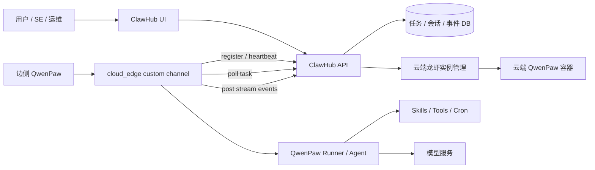
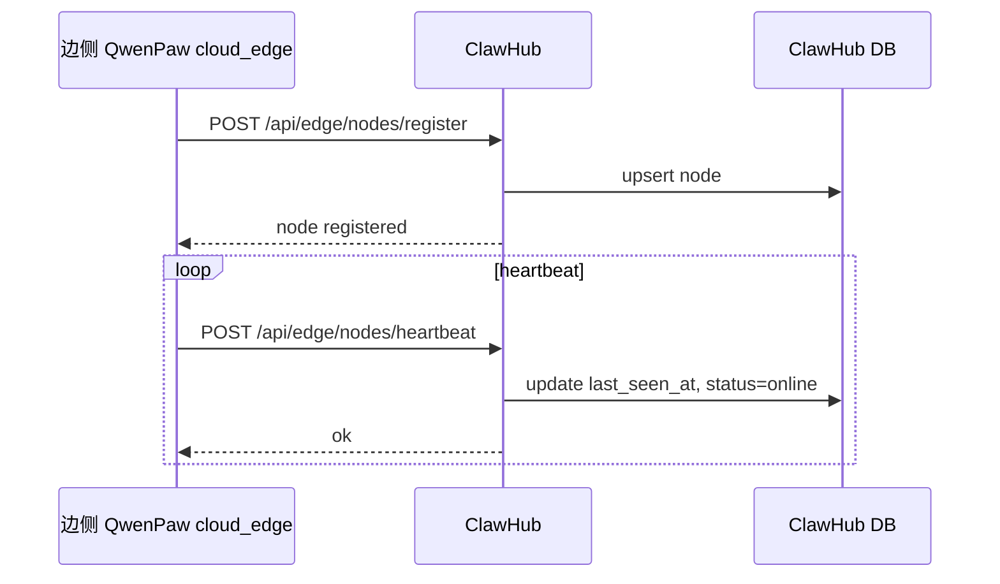
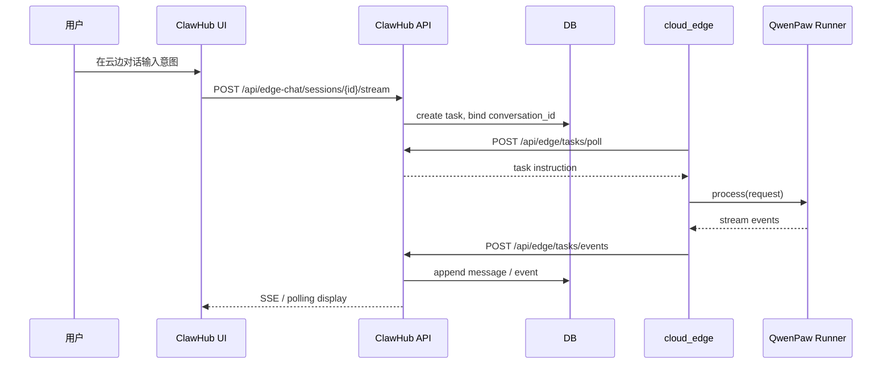
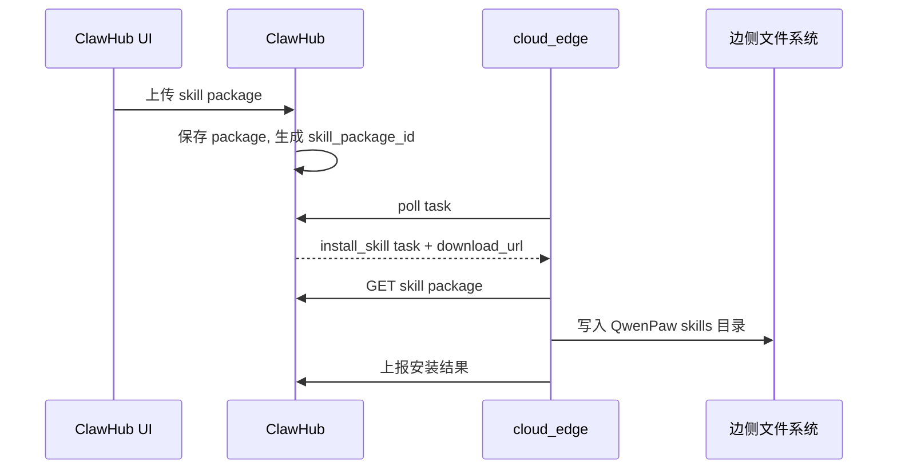
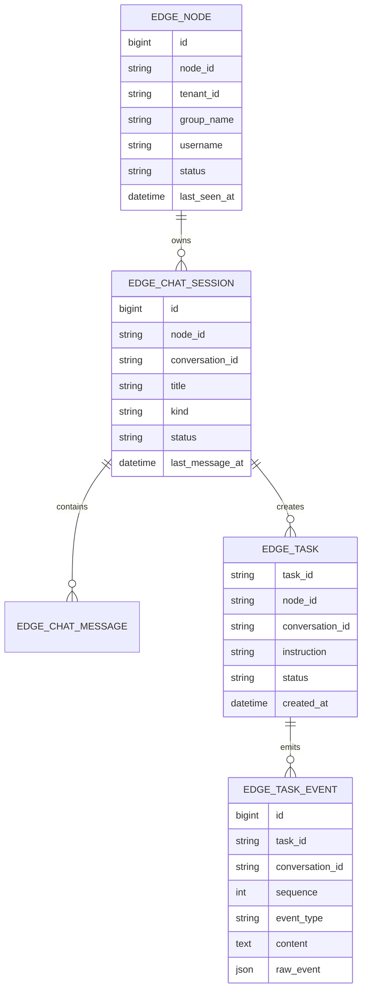

# Cloud Edge Collaboration Custom Channel Design

> 本文用于沉淀 QwenPaw 云边协同方案。当前方案目标是：在尽量不侵入 QwenPaw 核心代码的前提下，通过 custom channel 让边侧 QwenPaw 主动连接云端 ClawHub，完成边侧注册、云端意图下发、流式结果回传、技能下发与后续任务协同。

## 1. 背景

系统包含三类角色：

- **ClawHub**：云端控制台，负责用户登录、云端龙虾实例管理、边侧节点管理、云边对话与任务编排。
- **云端 QwenPaw**：部署在云服务器上的 QwenPaw 实例，由 ClawHub 创建和纳管。
- **边侧 QwenPaw**：部署在客户生产网络 Linux 机器上的 QwenPaw 服务，无 UI 或弱 UI，不能要求客户开放入站端口。

边侧通常处于客户机房或内网环境。评审中明确提出：不应依赖“云端主动访问边侧端口”，应由边侧主动连接云端，并且要支持双向业务语义：

- 云端可以向边侧下发意图、任务、技能。
- 边侧可以将任务执行过程、执行结果、定时任务输出回传到云端。
- 云端 UI 能在同一个会话里看到多轮对话和边侧回传事件。

## 2. 目标

本方案的目标如下：

- **边侧零入站端口**：边侧只主动访问 ClawHub HTTPS 接口，不要求客户机房开放边侧端口。
- **custom channel 解耦**：云边协同逻辑尽量放在 `custom_channels/cloud_edge` 中，不直接侵入 QwenPaw agent runner、model、core channel 代码。
- **支持流式回传**：边侧执行过程中产生的 reasoning、message、tool、error 等事件可持续回传到云端。
- **支持多边侧节点**：一个租户下可以注册多个边侧节点，例如端侧、边侧两个节点。
- **支持技能下发**：云端可以下发 skill 包或 skill 调用任务，由边侧执行后回传结果。
- **支持任务沉淀**：任务、会话、事件在 ClawHub 存库，便于查询、审计、问题排查。

## 3. 非目标

当前阶段不追求以下内容：

- 不实现完整插件市场、插件安装 UI、插件版本治理。
- 不要求边侧部署 Docker，边侧可以直接部署 QwenPaw Python 服务。
- 不强依赖 WebSocket，优先用 HTTPS 长轮询和事件上报模拟双向通信。
- 不在边侧开放公网端口。
- 不把云边通信强耦合到飞书、微信等外部 IM channel。IM 只是入口之一，不是云边协议本身。

## 4. 总体架构



核心思想：

- ClawHub 不直接 SSH 到边侧，不直接访问边侧端口。
- 边侧 QwenPaw 启动后由 `cloud_edge` custom channel 主动向 ClawHub 注册。
- ClawHub 将云端用户的意图、任务、skill 调用写入任务表。
- 边侧 `cloud_edge` 通过长轮询拉取任务，转换为 QwenPaw channel 消息，调用本地 `process` 执行。
- 执行过程中的流式事件通过 HTTPS POST 回传 ClawHub。
- ClawHub 将事件写入同一个云边会话，并通过 UI 展示给用户。

## 5. 为什么使用 custom channel

QwenPaw 中 channel 的语义是“消息入口与出口适配器”。飞书 channel、console channel、API channel 都属于这种角色：把外部消息转换成 QwenPaw 内部可处理的 request，再把结果返回到对应外部系统。

云边协同中，边侧收到的消息来自 ClawHub，本质上与“飞书收到消息后交给 QwenPaw 处理”类似：

```text
飞书消息 -> 飞书 channel -> QwenPaw process -> 飞书回复
云端任务 -> cloud_edge channel -> QwenPaw process -> 云端事件回传
```

因此使用 custom channel 的好处是：

- 复用 QwenPaw 已有 channel 生命周期。
- custom channel 可以拿到 `process` 回调，不需要自己重新实现 agent runner。
- 云边协议、注册、心跳、轮询、事件上报都集中在一个目录中，便于迁移到干净分支。
- 对 QwenPaw 核心代码侵入小，升级主线代码时冲突更少。

需要诚实说明的是：custom channel 不是完整插件系统。它目前没有 plugin.json、插件管理页面、强 schema 校验、版本治理能力。后续如果要产品化，可以把 custom channel 包装成正式 plugin。

## 6. cloud_edge custom channel 职责

边侧 custom channel 建议目录：

```text
<QWENPAW_WORKING_DIR>/custom_channels/cloud_edge/
  channel.py
  README.md
  config.example.json
```

主要职责：

- 读取边侧配置，例如 ClawHub 地址、租户、群组、用户名、nodeId、token。
- 启动时向 ClawHub 注册节点。
- 周期性发送 heartbeat。
- 长轮询拉取待执行任务。
- 将任务转换为 QwenPaw 内部消息并调用 `process`。
- 将模型输出、工具输出、错误、最终结果按事件上报到 ClawHub。
- 对长任务、定时任务、skill 调用进行会话绑定。

建议配置示例：

```json
{
  "enabled": true,
  "base_url": "https://clawhub.example.com",
  "tenant_id": "tenant-a",
  "group_name": "prod-edge",
  "username": "edge-linux-01",
  "node_id": "edge-linux-01",
  "token": "edge-registration-token",
  "poll_interval_seconds": 3,
  "heartbeat_interval_seconds": 15,
  "capabilities": ["local-files", "shell", "browser", "skills", "cron"]
}
```

## 7. 核心流程

### 7.1 边侧注册与心跳



注册信息建议包含：

- `node_id`
- `tenant_id`
- `group_name`
- `username`
- `host_ip`
- `port`
- `os_name`
- `arch`
- `qwenpaw_version`
- `capabilities`
- `metadata`

### 7.2 云端意图下发



任务需要携带：

- `task_id`
- `conversation_id`
- `node_id`
- `instruction`
- `agent_id`
- `timeout`
- `max_iters`
- `source`
- `metadata`

### 7.3 流式事件回传

边侧执行时，`cloud_edge` 不只等待最终结果，而是将过程事件持续上报。

事件类型建议：

- `reasoning`
- `message_delta`
- `message`
- `tool_call`
- `tool_result`
- `error`
- `completed`

事件上报结构：

```json
{
  "task_id": "task-001",
  "conversation_id": "edge-linux-01:chat:001",
  "node_id": "edge-linux-01",
  "sequence": 12,
  "event_type": "message_delta",
  "content": "正在处理...",
  "raw_event": {}
}
```

ClawHub 根据 `conversation_id` 将事件归入同一个会话。这样用户在云端 UI 里看到的是一个连续对话，而不是一堆离散任务。

## 8. 技能下发方案

技能下发分两类。

### 8.1 调用边侧已有 skill

云端只下发 skill 调用意图：

```json
{
  "type": "skill_call",
  "skill_name": "inspect_logs",
  "instruction": "检查最近 30 分钟的错误日志",
  "arguments": {}
}
```

边侧要求：

- skill 已经安装在边侧 QwenPaw。
- `cloud_edge` 将任务交给 QwenPaw runner，由 agent 选择或显式调用 skill。
- 执行结果通过事件回传。

### 8.2 下发新的 skill 包

云端先上传 skill 包，再下发安装任务：



MVP 阶段可以只支持调用已有 skill。正式版再补 skill 包签名、版本、灰度、回滚。

## 9. 定时任务与边侧主动上报

边侧无人值守时，不能依赖用户打开边侧 UI。因此定时任务应该从云端下发创建，并绑定到云端会话。

推荐方式：

- 云端创建“任务会话”。
- 云端下发意图：“在边侧创建 QwenPaw 原生 cron 任务，并指定 channel 为 cloud_edge，target user 为 clawhub，conversation_id 为当前会话”。
- 边侧 QwenPaw 使用原生 cron 能力创建任务。
- cron 每次触发时，输出仍走 `cloud_edge` 回传到同一个云端会话。

这样可以避免“边侧自己产生的任务不知道回传给云端哪个用户/哪个会话”的问题。

限制与约定：

- 所有需要回传云端的边侧任务，应由云端发起或注册到 ClawHub 会话。
- 如果边侧本地私自创建任务，则必须显式配置 `conversation_id` 或默认上报目标，否则无法可靠归属到某个云端用户。

## 10. ClawHub 后端接口草案

节点接口：

```text
POST /api/edge/nodes/register
POST /api/edge/nodes/heartbeat
GET  /api/me/edge-chat/nodes
```

任务接口：

```text
POST /api/me/edge-chat/sessions
GET  /api/me/edge-chat/sessions
GET  /api/me/edge-chat/sessions/{sessionId}/messages
POST /api/me/edge-chat/sessions/{sessionId}/stream
DELETE /api/me/edge-chat/sessions/{sessionId}

POST /api/edge/tasks/poll
POST /api/edge/tasks/events
POST /api/edge/tasks/{taskId}/complete
```

技能接口：

```text
POST /api/me/edge-skills/packages
GET  /api/edge/skills/packages/{packageId}
POST /api/me/edge-skills/install-tasks
```

## 11. 数据模型草案



## 12. 安全设计

基础安全要求：

- 边侧注册必须携带 token。
- token 绑定租户、节点组、节点身份。
- ClawHub 所有用户态接口必须校验当前用户权限。
- 用户只能看到自己租户下授权的边侧节点。
- skill 包需要校验大小、类型、签名或 hash。
- 任务下发需要审计，保留用户、时间、节点、指令摘要。
- 敏感配置不能写入对话消息和日志。

生产建议：

- 使用 HTTPS。
- token 支持轮换。
- 节点可禁用。
- 高危工具调用在边侧做 guard。
- 对 shell、文件、网络访问做权限分级。

## 13. 部署建议

边侧部署形态：

```text
Linux Host
  Python / Node / Chromium / required packages
  QwenPaw
  ~/.qwenpaw/custom_channels/cloud_edge
  systemd qwenpaw.service
```

边侧服务建议用 systemd 托管：

```ini
[Unit]
Description=QwenPaw Edge Service
After=network.target

[Service]
Type=simple
WorkingDirectory=/opt/qwenpaw
ExecStart=/opt/qwenpaw/venv/bin/python -m qwenpaw app --host 0.0.0.0 --port 8088
Restart=always
RestartSec=5
Environment=PYTHONPATH=/opt/qwenpaw/src

[Install]
WantedBy=multi-user.target
```

如果后续不希望边侧暴露 UI，可以将 `app` 启动保留为本地服务，外部只通过 `cloud_edge` channel 与 ClawHub 通信。

## 14. 当前 MVP 与后续演进

MVP 优先级：

1. 边侧注册、心跳、在线状态。
2. 云端创建云边会话。
3. 云端意图下发到指定边侧节点。
4. 边侧执行并流式回传。
5. 云端 UI 在同一会话展示多轮对话。
6. 会话删除、任务状态查看。

下一阶段：

1. skill 包上传、下发、安装、版本管理。
2. 原生 cron 任务创建与云端任务会话绑定。
3. 多节点选择策略，支持端侧/边侧二选一或同时执行。
4. 节点权限、租户隔离、审计日志。
5. custom channel 升级为正式 plugin。
6. 任务重试、断点续传、离线任务保留。

## 15. 风险与处理

| 风险 | 说明 | 处理 |
| --- | --- | --- |
| 客户机房网络不稳定 | 长连接容易断 | 使用 HTTPS 长轮询，失败重试 |
| 多用户同时操作一个边侧 | 会话归属混乱 | 所有任务绑定 conversation_id |
| 边侧主动任务不知道上报给谁 | 本地任务缺少云端上下文 | 要求需上报任务由云端发起或显式绑定 conversation_id |
| custom channel 能力弱于 plugin | 缺少插件管理 UI 和版本治理 | MVP 使用 custom channel，正式版升级 plugin |
| skill 下发有安全风险 | 可能执行高危代码 | 增加签名、审核、权限分级和审计 |
| QwenPaw 主线升级冲突 | 如果侵入核心会冲突 | 云边逻辑集中在 custom channel 和 ClawHub |

## 16. 结论

基于 custom channel 的云边协同方案是可行的。它符合边侧无入站端口的生产约束，也能复用 QwenPaw 原有 channel 与 runner 机制，避免在 MVP 阶段过度侵入核心代码。

短期建议继续以 `cloud_edge custom channel + ClawHub API + HTTPS 长轮询/事件上报` 作为主线推进。等功能稳定后，再将 custom channel 包装成正式 plugin，并补齐插件管理、版本治理、安全审计和 skill 包分发能力。
