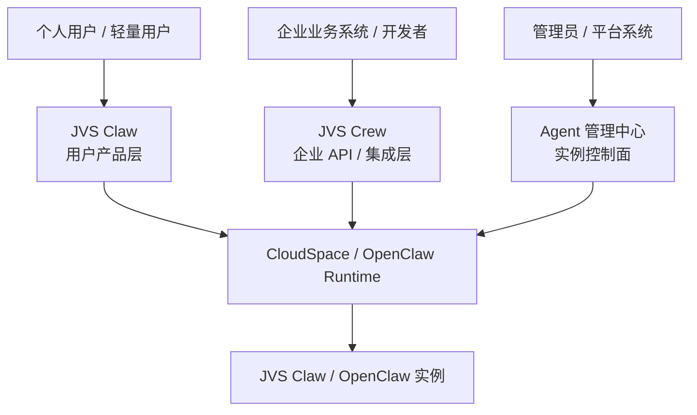
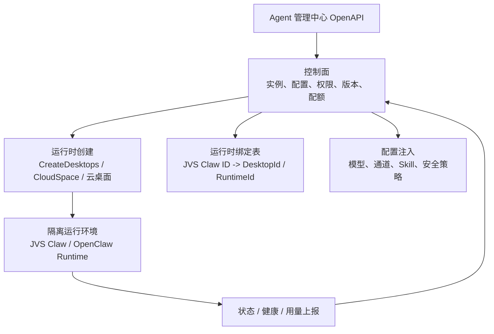
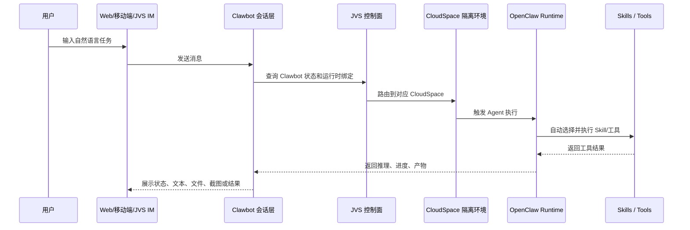
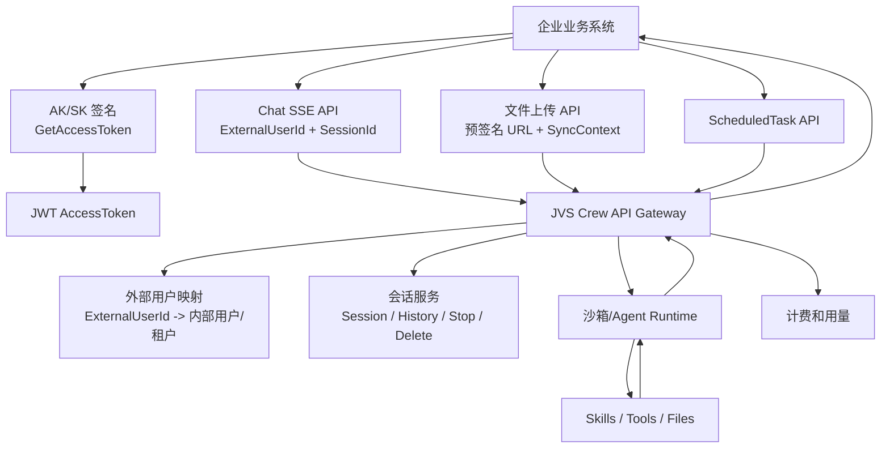
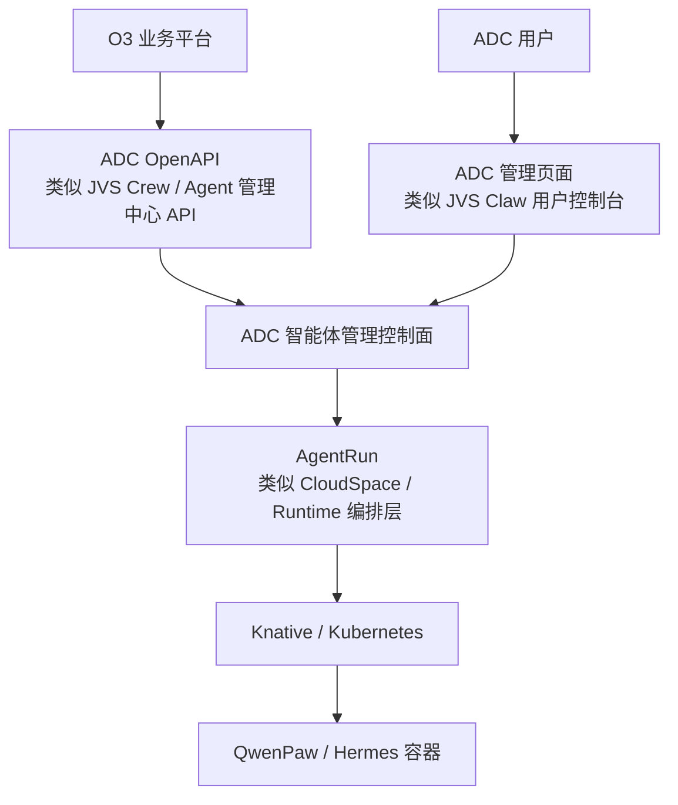

# 参考 JVS Claw / JVS Crew / Agent 管理中心的 ADC 架构洞察

日期：2026-05-14

## 1. 背景

ADC 是一个智能体管理平台，用户可以创建和管理 QwenPaw、Hermes 等智能体。ADC 底层通过 AgentRun 拉起智能体容器，AgentRun 封装 Knative、Kubernetes 等运行时能力。

当前 O3 作为另一个业务平台，希望复用 ADC 的智能体管理能力。围绕“O3 应该调用 ADC，还是直接调用 AgentRun”这个问题，需要参考 JVS Claw、JVS Crew 和阿里云 Agent 管理中心的公开产品形态。

本文目标：

- 梳理 JVS Claw、JVS Crew、Agent 管理中心三者的差异。
- 分析它们对 ADC / AgentRun / O3 架构的借鉴意义。
- 判断 O3 类业务诉求在竞品体系下更可能采用哪种接入方式。

## 2. 三个产品/能力的边界

### 2.1 JVS Claw：面向用户的智能体产品

JVS Claw 是面向个人用户、轻量办公用户和开发者的智能体产品。公开资料中，它的核心形态是：

- 用户创建一个 Clawbot。
- Clawbot 通过对话接收自然语言任务。
- 任务在 CloudSpace 云端隔离环境中执行。
- 用户可以在 Web、移动端或客户端查看任务过程和结果。

它的关键词是：

- Clawbot
- CloudSpace
- 云端隔离执行环境
- 文件、应用、浏览器、代码执行
- 技能 Skills
- 多端访问
- 任务可视化

公开资料参考：

- JVS Claw 介绍：https://jvsclaw.lat/
- 什么是 JVS Claw：https://help.aliyun.com/zh/document_detail/3030006.html
- 管理 Clawbot：https://help.aliyun.com/zh/jvs/user-guide/managing-clawbot

对 ADC 的类比：

> JVS Claw 类似 ADC 面向最终用户提供的“智能体产品形态”。用户在 ADC 上创建 QwenPaw 或 Hermes，就像用户在 JVS Claw 上创建 Clawbot。

### 2.2 JVS Crew：面向企业和开发者的智能体平台 API

JVS Crew 是企业级 AI 智能体平台，公开文档强调它提供企业级 AI 数字助理构建与托管能力，解决凭证托管、权限隔离、审计追踪、资源失控等企业级问题。

它的关键词是：

- 企业级智能体构建和托管
- 开放集成
- 弹性并发
- 可管可控
- 多租户隔离
- RBAC
- Skill 安全审核
- 审计追踪
- API 接入
- 会话、文件、定时任务、计费

JVS Crew API 公开能力包括：

- 获取 AccessToken
- Chat 流式对话
- 文件上传
- 同步文件到沙箱
- 会话列表
- 会话历史
- 删除会话
- 中止会话
- 创建、更新、查询、删除定时任务
- 查询计费和用户消耗

公开资料参考：

- 什么是 JVS Crew：https://help.aliyun.com/zh/jvs/product-overview/what-is-jvs-crew
- JVS Crew API 参考：https://help.aliyun.com/zh/jvs/developer-reference/jvs-crew-api-reference

对 ADC 的类比：

> JVS Crew 类似 ADC 后续对 O3、企业客户或其他业务系统开放的“企业级智能体 API 层”。它不只是创建容器，而是提供对话、会话、文件、任务、计费、审计等完整能力。

### 2.3 Agent 管理中心：面向实例创建和运行环境管理的控制面

阿里云公开文档中还有 Agent 管理中心 OpenAPI。它与 JVS Crew 不同，更接近“创建和管理 JVS Claw / OpenClaw 运行环境”的控制面。

公开资料显示，Agent 管理中心 OpenAPI 包含：

- 创建 JVS Claw 或 OpenClaw。
- 查询 Agent 运行时。
- 查询模型配置。
- 查询三方通道配置。
- 查询模型模板。
- 查询通道配置。
- 查询 Skill。
- Skill 授权。
- 安全策略。
- 积分配额。
- 用量查询。

公开资料参考：

- Agent 管理中心 OpenAPI 索引：https://help.aliyun.com/zh/wuying-workspace/agent-management-center-openapi-index

对 ADC 的类比：

> Agent 管理中心最直接对应 ADC。它负责创建和管理智能体运行环境，而不是直接面向最终用户完成所有对话任务。

## 3. 三者关系的合理理解

JVS Claw、JVS Crew 和 Agent 管理中心不是简单的包含关系，而是产品层、平台 API 层和控制面能力的分层关系。

可以这样理解：

重点判断：

- JVS Claw 更偏用户侧产品体验。
- JVS Crew 更偏企业和开发者集成。
- Agent 管理中心更偏智能体实例控制面。
- 三者可能共享底层 CloudSpace / OpenClaw Runtime，但对外暴露的抽象层不同。

## 4. 三个产品的运行原理洞察

本节尝试从公开资料反推 JVS Claw、JVS Crew、Agent 管理中心的运行原理。需要说明：

- **公开事实**：来自公开文档、帮助中心和 API 说明。
- **架构推断**：基于公开能力和常见云产品架构推导，不等同于厂商内部实现。

竞品分析的重点不是判断它们内部用了哪个具体服务，而是判断它们如何划分“用户产品层、企业 API 层、实例控制面和底层运行时”。

### 4.1 Agent 管理中心的运行原理

Agent 管理中心最像 ADC 的核心控制面。它的职责不是直接完成用户对话，而是负责智能体实例的创建、配置、授权、运行时查询和治理。

公开事实：

- Agent 管理中心 OpenAPI 提供创建 JVS Claw 或 OpenClaw 的能力。
- 创建动作中出现了类似 `CreateDesktops`、镜像 ID、Bundle、办公网络、规格等云资源概念。
- 文档提到可根据 JVS Claw ID 获取对应的 DesktopId。
- OpenAPI 覆盖模型配置、通道配置、Skill 授权、安全策略、积分配额和用量查询。

架构推断：

Agent 管理中心内部大概率采用“控制面 + 运行时绑定”的模式：

它的运行过程可以拆成几步：

1. 外部调用创建 Agent。
2. 控制面生成 Agent 记录，确定类型、镜像、规格、网络、套餐和权限。
3. 控制面调用底层运行时创建云端环境。
4. 底层运行时返回 DesktopId、访问入口、运行状态等信息。
5. 控制面把 JVS Claw ID 与底层 DesktopId 绑定。
6. 控制面注入模型、通道、Skill、安全策略等配置。
7. 后续查询、修复、升级、用量统计都通过控制面完成。

这个模式对 ADC 的直接启发是：

> ADC 也应该维护 `agent_instance_id -> runtime_id` 的绑定关系。O3 不应该直接拿 AgentRun 的底层 ID 当业务主键。

### 4.2 JVS Claw 的运行原理

JVS Claw 是用户真正感知到的产品层。用户看到的是 Clawbot、对话框、CloudSpace、文件、任务进度和定时任务，但背后一定有控制面和运行时协作。

公开事实：

- JVS Claw 由 Clawbot 和 CloudSpace 组成。
- Clawbot 负责接收用户指令、维护任务线程和呈现状态。
- CloudSpace 是隔离云端环境，负责运行浏览器、文件处理、代码执行等任务。
- JVS Claw 支持网页端、移动端和客户端访问。
- 云端 Clawbot 支持版本升级，升级期间短暂不可用。
- CloudSpace 可以重启；异常时可以通过 OpenClaw 自身命令进行修复。
- 本地 Clawbot 由桌面客户端部署，版本与客户端绑定。

架构推断：

JVS Claw 的核心不是“一个聊天机器人”，而是“聊天入口 + 云端执行空间 + 技能执行引擎 + 文件/状态同步”的组合。

它背后的关键设计点有四个：

1. **用户不直接面对容器。**

   用户面对的是 Clawbot 和 CloudSpace，而不是 Pod、容器、端口或镜像。

2. **Clawbot 是产品抽象，不等同于运行时容器。**

   一个 Clawbot 背后可能绑定一个 CloudSpace，也可能经历升级、重启、修复、迁移，但用户仍然看到同一个 Clawbot。

3. **CloudSpace 是可见的执行空间。**

   它把 Agent 的执行过程可视化，让用户知道任务不是只在模型里“说”，而是在隔离环境里“做”。

4. **Skills 是能力层，不是用户手动调用的脚本集合。**

   JVS 文档说明 Skill 会根据任务自动匹配和加载，用户更多是管理启停和授权，而不是每次手动选择底层工具。

对 ADC 的启发：

- ADC 页面上不应该出现过多容器、端口、镜像、挂载路径等信息。
- 用户应该看到的是“龙虾实例、对话、文件、任务、技能、模型、状态”。
- 重启、修复、升级应该是产品动作，而不是要求用户理解 Docker 或 K8s。
- QwenPaw / Hermes 容器是实现细节，ADC 应该把它包装成稳定的 Agent 实例。

### 4.3 JVS Crew 的运行原理

JVS Crew 更像企业 API 层。它不是普通用户通过页面养一只 Clawbot，而是让企业系统用 API 批量接入智能体能力。

公开事实：

- JVS Crew API 使用 AK/SK 和 JWT 两类认证。
- 调用方通过 `ExternalUserId` 标识外部业务用户。
- Chat 接口支持 SSE 流式对话。
- API 支持 `SessionId`，可查询会话列表和历史。
- 文件先获取上传 URL，再上传到对象存储，随后同步到沙箱。
- API 支持创建、更新、查询、删除定时任务。
- API 支持用量和计费查询。

架构推断：

JVS Crew 的运行链路更像“企业 API Gateway + Agent 会话编排 + 沙箱执行”的模式。

它与 JVS Claw 的差异是：

- JVS Claw 面向用户体验，重点是 Clawbot 和 CloudSpace。
- JVS Crew 面向系统集成，重点是 API、外部用户、会话、文件、任务和计费。
- JVS Crew 的调用方不一定关心“这个任务跑在哪个 CloudSpace 容器里”，只关心 API 是否稳定返回。

所以，JVS Crew 的智能体不应简单理解成“JVS Claw 创建出来的那个容器”。更合理的判断是：

> JVS Crew 可能复用和 JVS Claw 相同或相近的底层沙箱/Agent Runtime，但它对外暴露的是企业级 API 抽象，而不是 Clawbot 产品 UI 抽象。

对 ADC 的启发：

- ADC 后续给 O3 的接口，不能只停留在实例创建。
- 如果 O3 要把智能体能力嵌入自己的业务系统，ADC 需要 Crew 风格 API。
- `ExternalUserId` 这种外部用户映射很关键，O3 不应该被迫使用 ADC 的用户 ID。
- 文件、会话、定时任务、计费都应该成为 ADC API 的一部分，而不是让 O3 自己拼底层接口。

### 4.4 三者的分层关系

从运行原理看，三者不是互相替代，而是面向不同使用者的不同抽象层。

| 层次 | 产品/能力 | 面向对象 | 主要职责 | 对 ADC 的启发 |
|---|---|---|---|---|
| 用户产品层 | JVS Claw | 个人用户、轻量用户 | 创建 Clawbot、对话、文件、任务可视化、CloudSpace 操作 | ADC 页面体验 |
| 企业 API 层 | JVS Crew | 企业系统、开发者、业务平台 | 流式对话、会话、文件、定时任务、计费、外部用户映射 | ADC 对 O3 的 OpenAPI |
| 实例控制面 | Agent 管理中心 | 管理员、平台系统 | 创建实例、模型、通道、Skill、安全策略、配额、运行时绑定 | ADC 核心控制面 |
| 运行时层 | CloudSpace / OpenClaw Runtime | 平台内部 | 隔离执行、工具调用、文件操作、浏览器和代码执行 | AgentRun |

ADC 如果只做用户页面，就只能对标 JVS Claw 的一部分。

ADC 如果只做容器 CRUD，就只做到了 Agent 管理中心的一小部分。

ADC 如果要支撑 O3，就必须补齐 JVS Crew 这种企业 API 层。

### 4.5 对竞品运行原理的深层判断

从 JVS 的三层产品形态可以看到一个很重要的趋势：

> 成熟 Agent 平台不会把“智能体运行时”直接裸露给业务系统，而是通过控制面和 API 层做多重抽象。

原因有五个：

1. **运行时不稳定，业务 API 必须稳定。**

   底层镜像、CloudSpace、K8s、云桌面规格都可能变化，但对业务方暴露的 `Chat`、`Session`、`Task`、`File` API 应该保持稳定。

2. **用户身份和运行时实例不是一回事。**

   JVS Crew 使用 `ExternalUserId`，说明外部业务用户需要映射到平台内部用户、会话和资源，而不是直接映射到容器。

3. **文件和任务需要平台级治理。**

   文件上传、同步到沙箱、定时任务、执行记录、用量计费都不能丢给底层容器自己解决。

4. **升级和修复必须由控制面兜底。**

   JVS Claw 的升级、CloudSpace 重启、离线修复都表明控制面需要有运行时修复能力，而不是让用户自己进入容器处理。

5. **企业集成关注审计和成本。**

   JVS Crew 明确有计费和用户消耗查询，这说明企业 API 层天然要管理用量、审计、追踪和成本分摊。

映射到 ADC/O3：

- AgentRun 是运行时，不适合作为 O3 的直接依赖。
- ADC 应该沉淀控制面，管理实例、镜像、配置、策略和运行时绑定。
- ADC 应该提供 Crew 风格 API，支撑 O3 的业务集成。
- QwenPaw / Hermes 的镜像可以替换，但必须遵守 ADC 定义的 Runtime Contract。

## 5. 映射到 ADC / AgentRun / O3

ADC、AgentRun、O3 可以参考如下映射：

建议映射关系：

| JVS 体系 | ADC 体系 | 说明 |
|---|---|---|
| JVS Claw | ADC 用户页面和智能体产品体验 | 面向用户创建、对话、管理智能体 |
| JVS Crew | ADC 对 O3 暴露的企业级 API | 面向外部平台提供会话、文件、任务、流式对话等能力 |
| Agent 管理中心 | ADC 智能体实例控制面 | 创建、管理、升级、配置智能体运行环境 |
| CloudSpace / Runtime | AgentRun | 负责底层运行环境、资源、容器、隔离和调度 |
| Clawbot / OpenClaw 实例 | QwenPaw / Hermes 实例 | 真正执行任务的智能体容器 |

## 6. 对 O3 接入方案的启发

O3 的诉求是复用 ADC 的智能体管理能力，并可能后续定制镜像或定制智能体代码。

参考 JVS 体系后，可以得到以下判断。

### 6.1 O3 不应该直接对接 AgentRun

如果 O3 直接对接 AgentRun，就相当于业务系统绕过 Agent 管理中心，直接操作底层运行时。

这会带来几个问题：

- O3 需要自己管理实例、镜像、配置、Secret、状态、升级、审计。
- O3 会直接耦合 AgentRun 的底层 API。
- ADC 和 O3 会形成两套智能体管理模型。
- 后续数据迁移、版本治理和权限审计会变复杂。

从 JVS 参考看，公开资料中更强调通过 Agent 管理中心或 Crew API 暴露能力，而不是让业务方直接调用底层 CloudSpace 或运行时。

### 6.2 ADC 应该承接 Agent 管理中心角色

ADC 不应该只是 AgentRun 的 UI，也不应该只是容器 CRUD 的转发层。

ADC 应该管理：

- 智能体实例
- 智能体类型
- 镜像版本
- 运行时绑定
- 模型配置
- 通道配置
- Skill 授权
- 安全策略
- 数据目录
- Secret
- 用量和审计

这与 JVS Agent 管理中心的定位最接近。

### 6.3 ADC 后续可以演进出 Crew 风格 API

如果 O3 不只是要创建实例，还要直接在自己系统里完成聊天、文件上传、定时任务、会话历史查询，那么 ADC 需要提供类似 JVS Crew 的 API。

建议分层：

1. **实例管理 API**

   类似 Agent 管理中心，负责创建、删除、重启、升级、查询实例。

2. **智能体业务 API**

   类似 JVS Crew，负责流式对话、会话、文件、定时任务、计费、审计。

这样 ADC 不会停留在“容器管理台”，而是会逐步成为“智能体能力平台”。

## 7. O3 定制镜像时的参考方案

O3 的一个现实诉求是：先使用 ADC 标准能力，后续可能换成自己的镜像，甚至定制智能体代码。

参考 JVS 体系，更合理的做法不是让 O3 绕过 ADC，而是把 O3 的定制纳入 ADC 的镜像和版本治理。

### 7.1 不推荐的做法

不推荐：

- 现在 O3 用 ADC 创建标准 QwenPaw 实例。
- 后续 O3 直接用 AgentRun 创建自己的镜像。
- ADC 不再感知 O3 实例。

这个路径会导致：

- 数据迁移不可控。
- 会话、文件、任务、模型配置难以统一。
- ADC 无法统一审计和计费。
- O3 和 ADC 的实例模型分裂。

### 7.2 推荐的做法

推荐：

- ADC 支持多智能体类型。
- ADC 支持镜像版本注册。
- ADC 支持 O3 专属镜像。
- ADC 定义运行时契约。
- O3 镜像只要遵守契约，就可以被 ADC 创建、升级、删除和治理。

建议 ADC 抽象：

- `agent_type`：例如 `qwenpaw`、`hermes`、`o3-qwenpaw`
- `image_version_id`：镜像版本 ID
- `runtime_contract_version`：运行时契约版本
- `data_schema_version`：数据结构版本
- `data_volume_ref`：工作目录引用
- `secret_volume_ref`：密钥目录引用
- `migration_hooks`：升级迁移脚本

### 7.3 Runtime Contract 建议

ADC 应定义统一运行时契约，要求所有受管智能体镜像遵守。

最小契约包括：

- 固定启动端口。
- 健康检查接口。
- 聊天接口。
- 流式对话接口。
- 会话历史查询接口。
- 文件上传和下载接口。
- 模型配置接口。
- 定时任务接口。
- 工作目录位置。
- Secret 目录位置。
- 版本和能力声明接口。

如果 O3 自定义镜像仍遵守这些契约，就可以在 ADC 下被统一管理。

## 8. 迁移成本判断

O3 后续从 ADC 标准镜像迁移到 O3 自定义镜像，成本取决于定制深度。

| 定制深度 | 说明 | 迁移成本估算 |
|---|---|---|
| 只换镜像，API 和数据目录完全兼容 | 新镜像仍遵守 ADC Runtime Contract | 3-5 人天 |
| 定制部分代码，但保持接口和目录兼容 | 需要做兼容验证和少量适配 | 5-10 人天 |
| 数据结构变化，需要迁移脚本 | 需要备份、迁移、校验、回滚 | 10-20 人天 |
| 深度 fork，接口、目录、会话、任务模型都变 | 本质是迁移到另一个智能体产品 | 20-40+ 人天 |

迁移成本能否控制住，关键取决于：

- 是否提前定义 Runtime Contract。
- 是否把数据目录和 Secret 目录标准化。
- 是否支持镜像版本和数据 schema 版本。
- 是否有迁移脚本和回滚机制。
- O3 是否愿意约束自己的定制边界。

## 9. JVS 面对 O3 类诉求可能怎么做

基于公开资料，可以做如下判断。

### 9.1 如果是轻量使用

如果 O3 只是想让用户快速拥有一个智能体，JVS 可能会让 O3 使用类似 JVS Claw 的标准产品能力。

这对应：

- 用户创建 Clawbot。
- 使用标准模型、标准 Skill、标准 CloudSpace。
- 通过页面或客户端使用。

对应 ADC 的方案 1。

### 9.2 如果是平台级接入

如果 O3 是业务平台，希望把智能体能力嵌入自己的系统，JVS 更可能让 O3 使用类似 JVS Crew API 的方式：

- 通过 ExternalUserId 映射外部用户。
- 通过 API 获取 token。
- 通过 Chat SSE 做流式对话。
- 通过 Session API 管理会话。
- 通过文件 API 上传和同步文件。
- 通过 ScheduledTask API 管理定时任务。
- 通过计费 API 查询用量。

对应 ADC 的方案 2。

### 9.3 如果是创建和管理运行环境

如果 O3 需要创建 JVS Claw / OpenClaw 运行环境，JVS 更可能通过 Agent 管理中心 OpenAPI 暴露能力。

这对应：

- 创建 Agent。
- 查询 Agent Runtime。
- 管理模型配置。
- 管理通道配置。
- 管理 Skill 授权。
- 管理安全策略。
- 查询配额和用量。

对应 ADC 的“实例管理 OpenAPI”。

### 9.4 不太可能的路径

JVS 不太可能建议 O3 直接绕过 Agent 管理中心去调用底层无影云电脑、容器、Kubernetes 或运行时服务。

原因是：

- 这会破坏 JVS 的控制面治理。
- 外部系统会直接耦合底层运行时。
- 安全、计费、审计、配额和升级都会失控。

这对应 ADC 不推荐的方案 3。

## 10. 对 ADC 的最终建议

参考 JVS Claw、JVS Crew 和 Agent 管理中心，ADC 应采用三层建设思路。

### 10.1 第一层：Agent 管理中心能力

这是当前最优先能力。

ADC 应支持：

- 创建智能体实例。
- 删除智能体实例。
- 启动、停止、重启实例。
- 查询实例详情。
- 查询运行状态。
- 管理模型配置。
- 管理通道配置。
- 管理 Skill。
- 管理安全策略。
- 查询用量和操作记录。

这层对标 JVS Agent 管理中心。

### 10.2 第二层：智能体产品页面

ADC 需要继续提供用户可操作的管理页面。

页面能力包括：

- 创建智能体。
- 对话。
- 文件管理。
- 定时任务。
- 模型配置。
- Skill 管理。
- 实例详情。
- 升级、修复、重启。

这层对标 JVS Claw。

### 10.3 第三层：企业级开放 API

当 O3 或更多业务平台接入时，ADC 应提供企业级 API。

API 能力包括：

- 机机鉴权。
- 外部用户映射。
- 流式对话。
- 会话管理。
- 文件上传。
- 定时任务。
- 用量查询。
- 审计查询。

这层对标 JVS Crew。

## 11. 结论

JVS 体系对 ADC 的最大启发是：

> 不要把智能体平台理解成“创建容器”。成熟产品会把它拆成控制面、产品层和企业 API 层。

对应到 ADC：

- AgentRun 是运行时，不应该直接暴露给 O3。
- ADC 应承担 Agent 管理中心角色。
- ADC 页面提供 JVS Claw 式用户体验。
- ADC OpenAPI 提供 JVS Crew 式企业集成能力。
- O3 后续定制镜像，应纳入 ADC 镜像版本和运行时契约治理，而不是绕过 ADC。

最终推荐：

> O3 应通过 ADC 使用智能体管理能力。ADC 对外暴露 Agent 管理中心 + Crew 风格 API，对内调用 AgentRun。这样既能支撑当前创建实例诉求，也能承接后续 O3 定制镜像、会话、任务、文件和计费等复杂能力。
